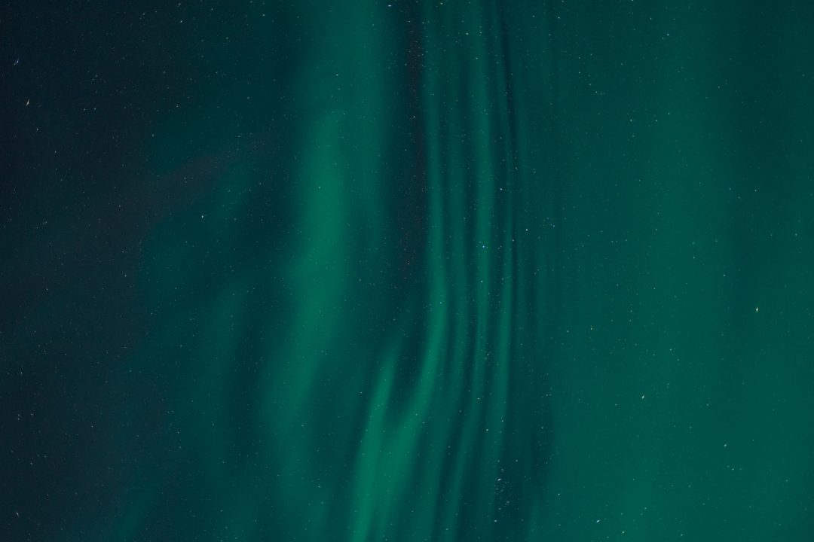
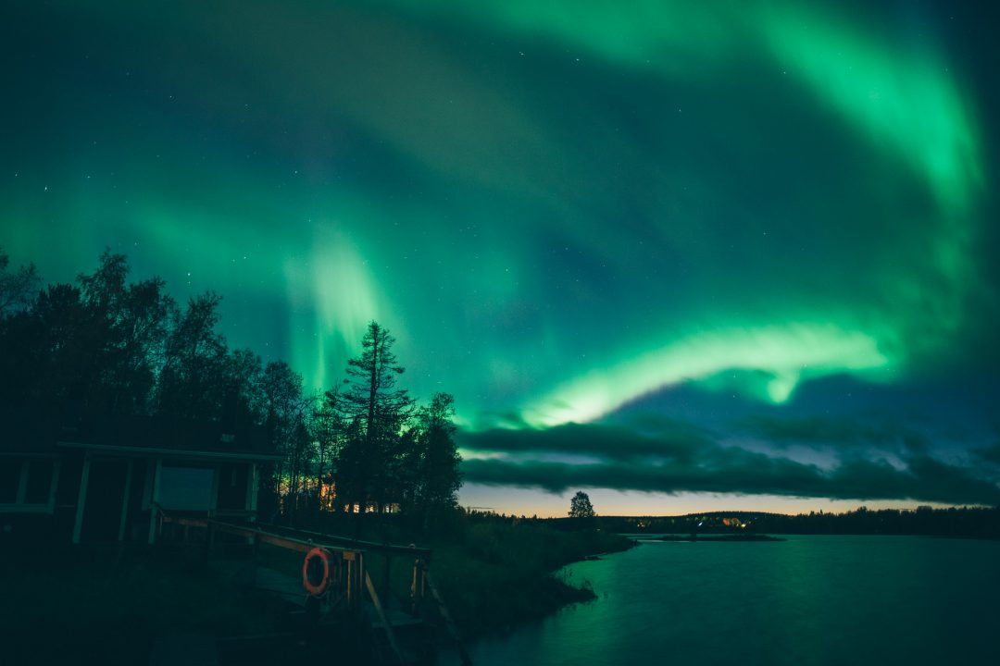
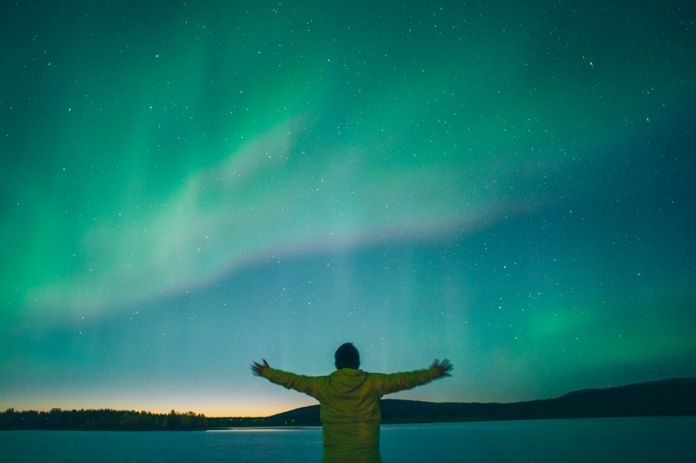
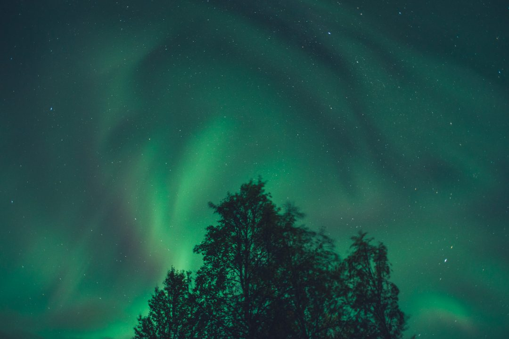
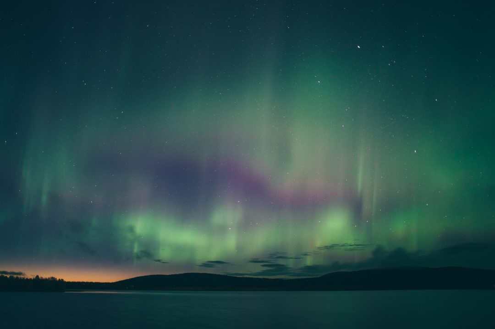
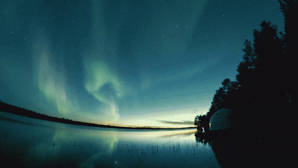
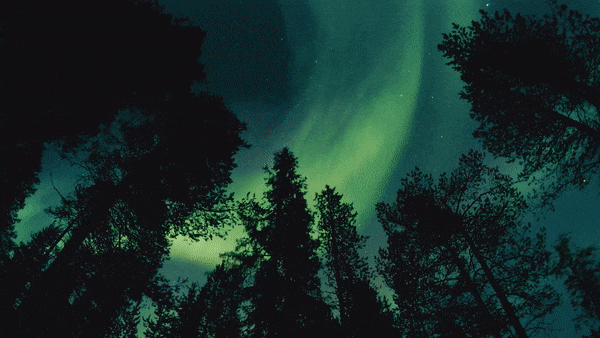
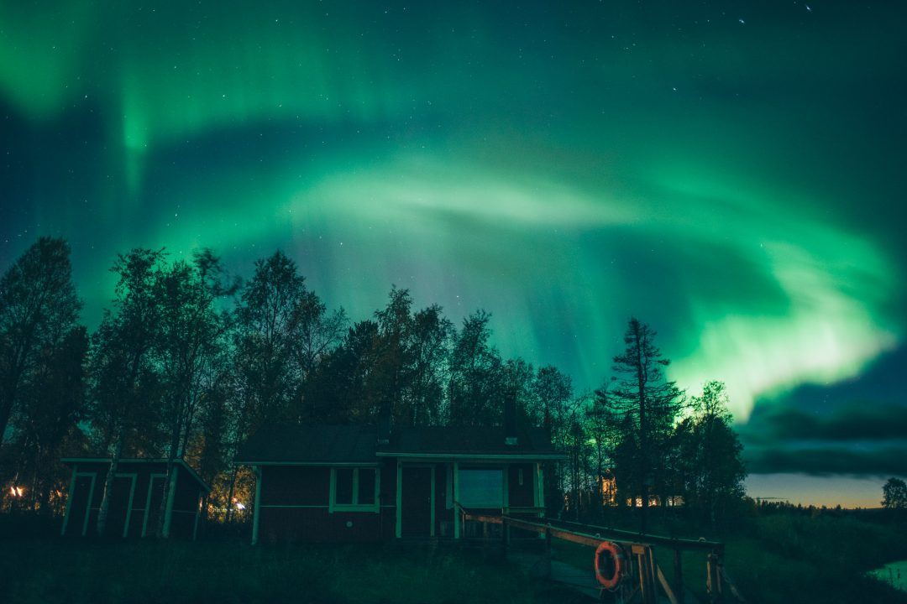

Depuis de nombreuses d’années, j’avais un rêve : voir et photographier les aurores boréales. J’en rêvais, j’en étais obsédé et je savais qu’un jour j’irai et en prendrai plein les yeux, la seule question était : quand ?

En septembre dernier, l’[Office de Tourisme de la Finlande](http://www.visitfinland.com/) m’a invité en Laponie au delà du cercle Arctique pour 1 semaine à découvrir les premières couleurs de l’automne : ruska. Avant de partir, je savais que j’avais une petite chance d’en voir car la bonne période pour voir et photographier les aurores boréales débute en août et je partais début septembre. Malgré tout à cette période, elles ne sont pas souvent spectaculaires par rapport à celles de l’hiver. J’ai acheté un trépied avant de partir en me disant que c’était peut être l’emporter pour rien mais si ça devait arriver… j’étais prêt. Il faut croire que mon moment était venu et que mon rêve devait se réaliser en Finlande puisque j’ai eu droit à 4 nuits absolument magiques avec des aurores boréales complètement folles au dessus de moi, pendant des heures… Je ne savais plus où donner de la tête. La plus mémorable en plus la première nuit où j'ai vu ma toute première aurore boréale, était assurément cette nuit passée à [dormir dans un dome sous les aurores boréales](http://jeremyjanin.com/dormir-dome-aurores-boreales-finlande). Relisez mon article pour savoir de quoi je parle.

#### Un peu d'histoire

En finnois, "aurore boréale" se dit "Revontuli" ce qui signifie la queue du renard. Les aurores seraient donc dûes à un renard qui balaie la neige avec sa queue.

Les aurores boréales sont un phénomène scientifique d’éruption solaire et si vous voulez en savoir plus, je vous recommande la lecture de [cet article](http://www.bastienfoucher.com/Tutoriels/Comprendre-aurores-boreales).

Souvent de teintes blanches, les photos ont tendance à toujours mieux rendre qu’à l’oeil nu lorsqu’on cherche à voir et photographier les aurores boréales. On peut toutefois les voir de plusieurs teintes : blanches, vertes, bleues, rosées, violettes parfois... Je dois avouer que pour ma part, je les ai vraiment vue bleues / vertes au dessus de ma tête avec quelques touches violettes / rosées parfois, quasiment chaque soir avec une intensité incroyable et une vitesse de mouvement parfois impressionnante. Ce n'est pas un mythe, elles dansent réellement.

À chaque nouvelle éruption, j’émettais un cri d’excitation et n’en revenais pas de ce qui se passait au dessus de moi. Je photographie les étoiles depuis pas mal d’années mais les aurores boréales étaient vraiment quelque chose d’hors norme pour moi. Le spectacle ne m’a pas déçu !

#### Quelle période pour voir et photographier les aurores boréales ?

La bonne période pour voir les aurores boréales est de fin septembre jusqu’à mars environ. Les mois les plus actifs sont souvent les plus froids : octobre, novembre, décembre, janvier, février, mais on peut quand même en voir, plus rarement, en dehors de ces mois là, comme ce fut mon cas. Les aurores boréales étant uniquement dictées par la nature et la météo, impossible de prévoir plusieurs mois à l’avance quand elles frapperont.

J'ai guetté l'activité solaire chaque jour avant et pendant le voyage le site de l'[Université de Fairbanks](http://www.gi.alaska.edu/AuroraForecast/Europe/20170112) en Alaska, qui trace l'activité des aurores boréales partout dans le monde. Il est simple, pas farfelu, mais ça me suffisait pour savoir si oui ou non, j'aurais une chance de les voir.

#### Où voir et photographier les aurores boréales ?

Toute la région au nord du cercle polaire arctique est sujette à voir des aurores boréales, je les avais manqué en hiver en Norvège il y-a 3 ans, et c’est en Finlande que je les aurais vues en premier.

Lors de mon séjour, j’étais concentré sur la Laponie Finlandaise, dans la région d’Yllas (prononcer Ul-las). C’est le paradis pour les amoureux de nature et sports outdoor comme moi.  Pas de grandes et hautes montagnes là bas, mais des forêts incroyables, des lacs par centaines, et des possibilités infinies pour des activités comme la randonnée, kayak, VTT, fat bike, raquettes, chien de traineau, motoneige...

Le must reste de sortir à pieds pour aller explorer soi même et chasser les aurores boréales seul. Vous pouvez aussi passer des guides ou des entreprises dont c'est le métier, mais méfiez vous car ça peut vite être l'usine et perdre de son charme comparé au fait d'y aller seul. Dans tous les cas, ne vous perdez pas.

#### Quel matériel pour voir et photographier les aurores boréales ?

Les aurores boréales sont visibles uniquement de nuits et souvent par des températures froides voire négatives, il est important de bien s’équiper pour ne pas avoir froid. On passe des heures sous les aurores boréales entre excitation et extase mais souvent en bougeant peu et il est important de faire attention à ce que le corps reste au chaud.

Pour ça, je vous conseille des vêtements chauds taillés pour l’hiver : première couche thermique, une polaire, une doudoune + coupe vent ou une gros manteau d’hiver. Les gants, bonnet, écharpes sont indispensables, et vous pouvez même emporter dans le sac des [chaufferettes](http://amzn.to/2jd2hsR) pour apporter un peu de chaleur de temps en temps. Prévoir quelques snacks et de l’eau pour se nourrir et s’hydrater, le froid vide les batteries aussi du corps humain.

Pour photographier les aurores boréales, il est important de bien se préparer avant le départ :

#### Trépied

Prévoir un [bon trépied stable](http://amzn.to/2iieyNE) est impératif car il faudra faire une pose longue et il est crucial que l’appareil photo ne bouge pas.  Si vous avez un trépied métallique, je vous conseille de mettre un tube de mousse sur la partie haute des pieds car elle ne conduit pas le froid comme le métal et vous évitera de vraiment vous geler les doigts en déplaçant le trépied. Ça parait anecdotique, mais le jour J, vous allez comprendre ce que je dis.

#### Appareil photo (avec mode Manuel)

Il vous faut impérativement un appareil photo avec un mode Manuel : reflex, hybride, bridge, compact expert et même… GoPro. Pour les appareils type reflex et hybrides, ils sont ceux à privilégier grâce à leur bonne montée en ISO (peu de grain dans les images - dépendent du boitier que vous possédez), de la possibilité de mettre des objectifs grand angles et lumineux pour des résultats optimums. Si vous avez un bridge ou un compact avec un mode manuel, vous pourrez aussi en faire, il y-aura peut être un peu plus de grain sur l’image, mais vous pourrez photographier les aurores boréales si vous avez ce mode.

Les modèles de GoPro HERO4, [HERO5](http://amzn.to/2iMIm0O) et suivants (hors Session), bénéficient d’un mode « Photo nocturne » / « Nightlapse » que vous pourrez activer pour faire ces photos. Pensez à prendre une ou plusieurs cartes mémoires de bonne capacité, on déclenche beaucoup une fois que les aurores se mettent à danser. On se lance ?

#### Batteries de rechanges

Le froid vide les batteries beaucoup plus vite qu’à température tempérée, prenez toujours le soin de prévoir plusieurs batteries de rechange pour pouvoir photographier les aurores boréales pendant des heures.

#### Comment photographier les aurores boréales ?

Une fois sur place, on s’y prend un peu comme pour [photographier les étoiles et la voie lactée](http://jeremyjanin.com/comment-photographier-les-etoiles-et-la-voie-lactee) comme je l’ai déjà expliqué.

#### Trouver le spot

Une forêt, un lac… tout endroit loin de pollution lumineuse (lampadaire, enseigne néons, passage de voitures…) et avec un premier plan sympa permet de faire des images et être créatifs. Le soir venu, je partais donc à pied, trépied sur le dos pour m’éloigner de toute pollution lumineuse, à la lueur de la frontale, pour trouver un bon spot pour faire des images. Lors de mon séjour en Laponie Finlandaise, j’ai surtout pu voir et photographier les aurores boréales sur le bord de différents lacs. C’est impressionnant de les voir se refléter dans l’eau et jouer avec l’effet miroir.

#### Préparation

Une fois bien équipé et avec le bon matériel, installez votre trépied de manière stable et dans un endroit où ce n’est pas risqué pour vous (on est de nuit à ce moment là donc bien repérer où on s’installe et si on peut marcher librement autour.)

#### Réglages

Passez votre appareil en mode Manuel et mettez vous avec votre objectif grand angle (35mm et inférieur. Je shoote principalement entre 14 et 24mm.) et choisissez une grande ouverture type f/2.8 et inférieur, mais je recommande de rester autour de **f/2.8** car des ouvertures à f/1.4 ou f/1.8 sont plus difficiles à gérer pour la mise au point à l’infini sur du paysage.

Pensez à désactiver l’autofocus pour pouvoir faire la mise au point manuelle vers l’infini.

Une fois à f/2.8, réglez votre vitesse d’obturation à 15 secondes environ. Il faudra plusieurs essais pour peaufiner vos réglages en fonction de l’intensité de l’aurore et des conditions de lumières (pleine nuit, début de nuit, lune ou non ?). J’ai pu photographier les aurores boréales avec des poses de 8 secondes comme avec des poses de 25 secondes.

Montez les ISO entre **800ISO** et **3200ISO** (à ajuster aussi en fonction de la resistance au grain de votre appareil et des conditions de lumière.) On peut allonger la vitesse pour baisser un peu les ISO et réduire le grain dans l’image. Essayez de rester dans des vitesses comprises **entre 8 et 25 secondes** en général.

Enfin, pour éviter de faire trembler l’appareil sur le trépied au moment du déclenchement, activez le retardateur avec un temps d’attente de 2 ou 10 secondes pour que les vibrations que vous émettrez au moment d’appuyer sur le déclencheur aient le temps de se résorber avant de commencer à prendre l’image.

Si je pouvais revivre ça une nouvelle fois, je signe tout de suite, mais en incluant plus d’humain comme j’aime le faire dans mes photos habituelles. J’ai pu partager ce moment avec Joachim, vidéaste pour Condé Nast Traveler en Espagne et nous étions comme deux gosses, chaque soir. Quel moment vécu et partagé alors que nous ne nous connaissions que depuis quelques heures. Un sacré souvenir qu’on oubliera jamais.

C’est étrange et fort de se dire que ces soirs là, on a partagé ces moments ensemble, on ne sait pas si on se reverra un jour mais on a ça en commun. On vit dans deux pays différents et pourtant, chacun de nous est marqué pour toujours par cette expérience unique.

Vous avez les cartes en main, à vous de jouer. Le jour où vous irez dans l’une de ces régions, vous verrez c’est irréel et magique. Le coup de coeur pour la Finlande fut indéniable et il me tarde de vous en dire plus sur le reste de ce périple. Pour moi, ça reste certainement les plus belles nuits de ma vie, malgré des bivouacs incroyables déjà vécus.

Un rêve devenu réalité, et quel rêve.

_Un grand merci à [Visit Finland](http://www.visitfinland.com/) pour cette invitation en Laponie. Comme d’habitude : lorsque je suis invité, je reste malgré tout entièrement libre de mes images et de mes propos._
