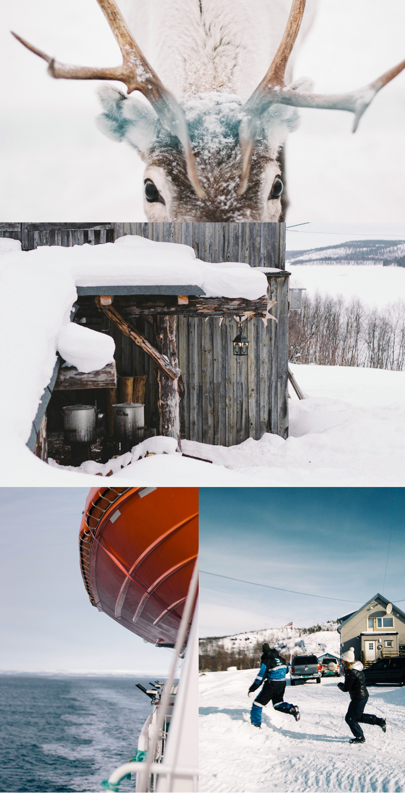
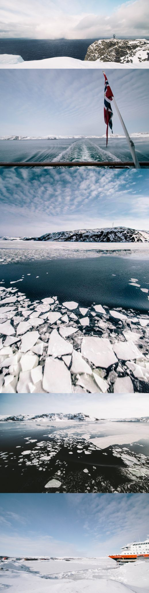
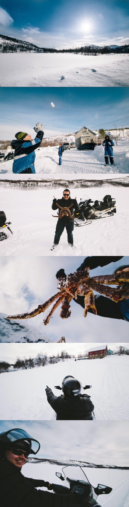
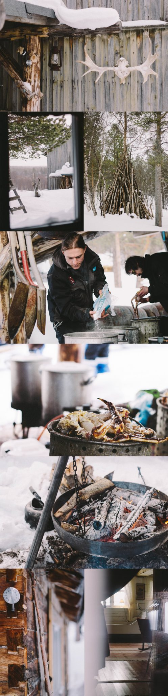
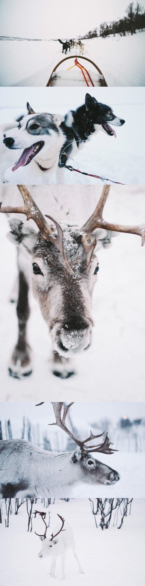

La Norvège, c'est un vrai Kinder, quand on y goute, à chaque fois on a droit à une nouvelle surprise. J'en avais déjà pris plein les yeux à **[Tromsø](http://jeremyjanin.com/tromso-en-norvege "Tromso")** le premier jour, mais c'était rien comparé à ce que je m'apprêtais à vivre quelques heures plus tard... Je n'avais pas revu de neige depuis noël et même si j'ai toujours vécu près des montagnes, c'était quand même sacrément magique tout ces paysages immaculés, calmes, apaisants et apaisés.

Après être partis à la nuit tombée de Tromsø à bord du MS Polarlys, le célèbre Express Côtier, voir les cotes norvégiennes depuis l'océan, c'est vraiment quelque chose. Si le vent glacial nous permettait de rester plus longtemps dehors, on l'aurait fait. Quand on est sur le pont, à regarder tout droit, à gauche, à droite (pas derrière c'est la porte!), les paysages changent à une vitesse... une montagne en remplace une autre, on sort d'un fjord pour mieux découvrir l'ocean arctique, on troque les rochers pour la glace, on échange la neige contre l'écume, même les nuages font place à un soleil radieux. Il est là, devant moi, il me tend les bras : l'Arctique. Oubliez ce que vous avez vu en cours de géo, les paysages sont incroyables, il faut le voir pour le croire. On est dans un autre monde, c'est fou, le blanc de la neige jure avec le blanc de la glace, tout comme le bleu de l'océan avec le bleu du ciel. On a envie de se jeter dedans (sauf qu'en vrai l'eau est à 2°c alors non!) du coup, on est des vrais gosses, quand on pose le pied à terre c'est pour une bataille de boule de neige, quand on en évite une à gauche, on se la prend sur la droite. On se court après pour se faire tomber, on se jette dans le bon mètre de neige fraiche en 1 seconde et on en met 10 à en ressortir. La neige a et aura toujours la capacité à nous faire revenir de vrais gosses en l'espace de quelques instants. C'est con hein ? MAIS C'EST BON!

<iframe src="http://player.vimeo.com/video/63025023?color=ffffff" width="950" height="405" frameborder="0" allowfullscreen="allowfullscreen"></iframe>

 _(C'est certainement l'une des pires vidéos que j'ai faite, je n'avais pas le temps de prendre un trépied, le froid m'empêchait de rester stable et c'était assez "speed" alors soyez indulgent, c'est vraiment un petit aperçu, juste pour que vous puissiez voir un tout petit peu comment ça peut être par là bas. Pardon.)_

Première escale : hinno..annig...svarg...Honnigsvag ! On retrouve un français expatrié là bas, c'est tout (tout) petit mais pas mal de monde au débarquement du bâteau, on prend un car direction le Nordkapp. Il dévale la route gelée ouverte par les chasses neige (un petit côté VIP quand même!) tout est superbe, immaculé, encore une fois, il ne manque (presque) plus que Frederic Lopez et un bandeau sur les yeux pour croire qu'on est Gilbert Mont dans Rendez-vous en Terre Inconnue. La lumière qui innonde la plaine est vraiment magique, l'ambiance est totalement différente du premier jour à Tromsø. Quand on arrive sur place, je manque de perdre mon nez, le vent chargé d'humidité mêlé au froid reste encore à ce jour le meilleur gel pour cheveux que j'ai pu trouver. Ca souffle, beaucoup, on sent vraiment que le Cap Nord est ouvert sur l'océan, les rafales à plus de 70km/h couplées au immense plaques de verglas sur le sol donnent une tournure assez... sympathique pour avancer jusqu'au bout du bout : le célèbre Cap Nord. La vue est vraiment à couper le souffle, entre les nuages chargés d'eau qui arrivent beaucoup plus vites que prévus, les rafales de vents qui soulèvent la neige, le soleil qui se reflète dans la glace... tout y est, et rien que pour le froid, le Cap Nord : ça se mérite. Il faisait -5°c mais avec les rafales de vent, c'était -25°c de ressenti alors c'était pas insurmontable mais sans bonnet, ça pique les oreilles un peu quand même :)

 Le bâteau vogue à nouveau, et malgré le menton relevé et le regard tourné vers le large : impossible de marcher avec dignité. Les vagues et le vent en ont décidé autrement. Les heures passent, le paysage change encore, les montagnes continuent à défiler sous leur plus beau manteau, le bâteau se transforme en brise glace à l'arrivée à Kirkenes : le terminus du trajet. Le soleil est incroyable, je sors sans veste par les -2°c ambiants, mais il fait bon. Ca fait du bien de mettre à nouveau le pied sur la terre ferme, et les paysages du grand nord nous accueille encore. Je ne m'en lasserai jamais je crois. On a envie de courir et crier partout, de profiter des grands espaces. Les yeux se perdent tant les étendues sont immenses. A peine le temps de poser les affaires, hop hop hop, direction la pêche au Crabe Royal au milieu d'un fjord gelé. Et on y va en motoneige. EN MOTONEIGE. Le rêve, le kiffe ce que vous voulez, mais en MOTONEIGE. Je ne me bouscule pas pour prendre les places dans les remorques derrière la motoneige en espérant l'improbable. Et là Ô MIRACLE "J'aurais besoin de quelques condu..." "MOI MOI MOI MOI MOI JE SUIS LA, FAUT SIGNER QUOI ?" "...cteurs pour la motoneige!" 5 minutes plus tard, le groupe part devant "Allez y, je ferme la marche" (en vrai, j'en avais jamais piloté, mais ça n'avait pas l'air compliqué, alors j'ai feinté pour pouvoir laisser les autres partir un peu devant et aller vite après pour les rattraper! Au début, ça allait viiiite : 50km/h. Booooh :( c'est pourri ! Bref, on verra pour le retour, mais déjà à 50km/h c'était foufou d'aller vite sur la glace comme ça. On arrive AU MILIEU DE NULLE PART pour sortir les filets de pêches et donc les crabes ! Mamma mia : tout ce qu'il y a et ils sont un peu (beaucoup) gros ! (petite astuce terrain : les mecs, évitez de balader les pinces du crabe trop près de la ceinture...). La pêche finie, on reprend les motoneiges pour aller les cuisiner (plus frais comme produit : tu meurs!) ET LA !!! "Allez y partez devant j'ai oublié de mettre mes gants" (c'est ça ouais). C'était foufou à 50km/h déjà, mais j'avais même pas trop regardé le compteur à l'aller. Je lance à mon coéquipier "on vise le 100 ?" en rigolant EVIDEMMENT. Mais en fait, en regardant le compteur, 60,70,80,90,100,110 ! WOUHOUUUUUUU ! Là c'était fou, fou, fou ! Genre FOU ! (bon on a eu droit à une petite remarque à l'arrivée en nous pointant le panneau "60km/h max. speed" "Ah pardon, ouais, mais on savait pas aussi nous!" en même temps on est sur un fjord gelé : y - a per-sonne ! (bon le retour, on a refait des folies, mais chut!) ) Mais c'était FOU ! J'ai adoré !

Le midi, on a donc mangé les crabes. Ca faisait une éternité que j'en avais pas mangé, mais là même pas besoin de mayo : 1 pince, puis une patte, et une autre pince... ici quand on enlève la coquille, il reste au moins autant de chaire qu'une saucisse de strasbourg (<- délicatesse inside). Du coup, j'ai mangé euh... ben... euh... 400g de crabe quelque chose comme ça ? Pardon, mais c'est trop bon :) Ah hé je vous ai pas parlé du cadre, c'est hyper typique, le genre d'endroit qu'on croit voir que dans les magazines, mais imaginez : la cabane en bois avec les bois de rennes au dessus de la porte, les vitres un peu embuées avec les rideaux rouges et blancs en haut des fenêtres, un feu pour se réchauffer les pieds. Le thermomètre qui ne dépasse pas le zéro, le tipi en bois derrière la maison, un vieux canapé sur la terrasse en bois pour s'assoir en regardant les crabes mijoter, dans la cour, embouteillage de motoneiges, entre les tas de bois, les outils et la luge en bois des enfants. Tout ça au milieu d'une immense forêt enneigée sur les rives du fjord gelé. Un autre monde j'vous dis.

Une fois rentrés, s'pas fini ! On reprend un peu la route cette fois pour l'hotel de neige de Kirkenes pour achever le séjour en beauté : visite de l'hotel de neige et traineau à chien. Le rêve, les amis, le rêve. Le traineau c'était une grande première pour moi et c'était trop bien. Vraiment chouette d'entendre que les bruits de la nature. Niveau sensation j'ai quand même préféré la motoneige, mais vraiment le traineau c'était super chouette. On aussi vu des rennes, de près, de très près, c'était juste PAR-FAIT en fait. L'hotel de neige était super impressionnant aussi, on a bu un sirop de baies locales, c'était le sirop le plus magique que j'ai goûté. Dommage, on ne pouvait pas en acheter, mais j'y retournerai rien que pour ça (enfin aussi pour tout ce que je viens d'écrire) parce que vraiment la Norvège, c'est des surprises, beaucoup de surprises, à chaque fois que tu en goûtes un peu plus, à chaque fois c'est un régal, et moins tu peux t'en passer. Un vrai kinder je vous dis.
