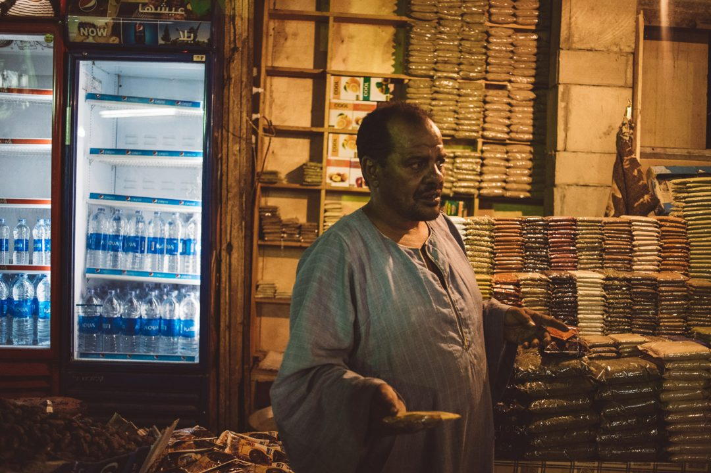
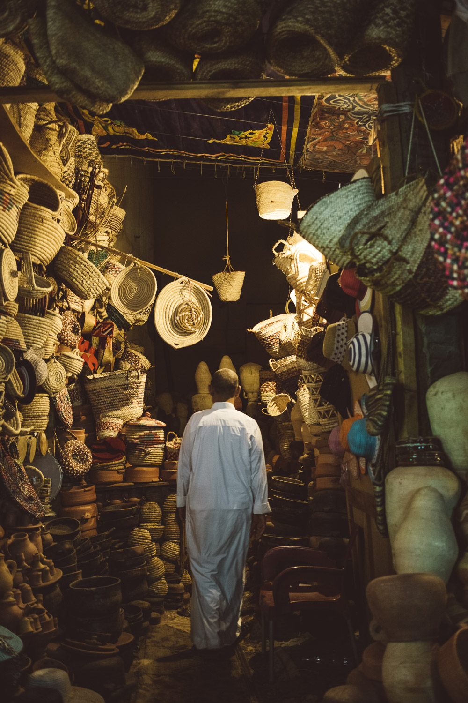
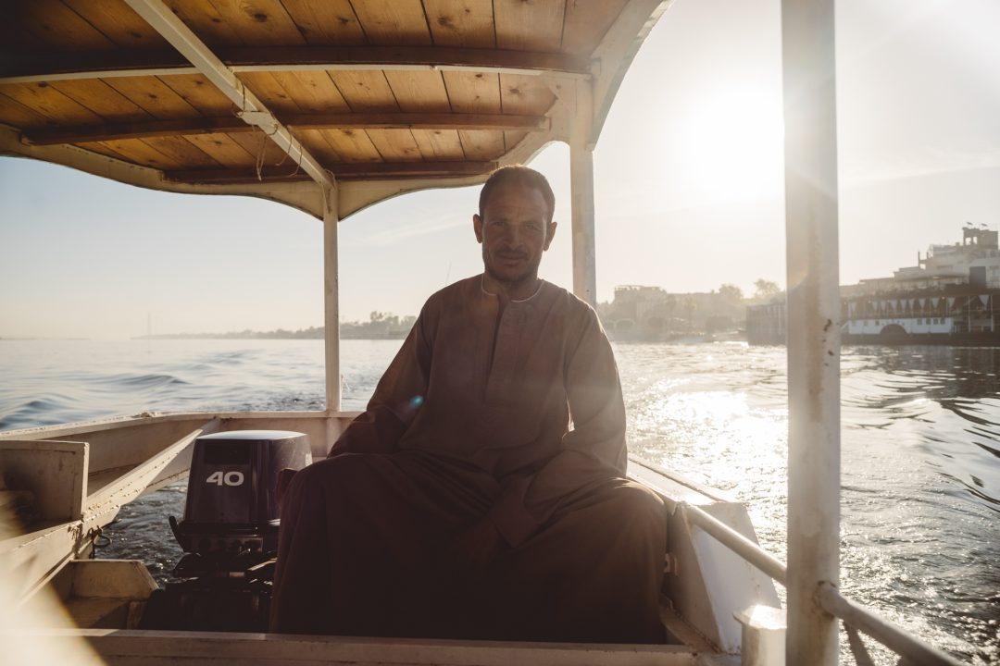
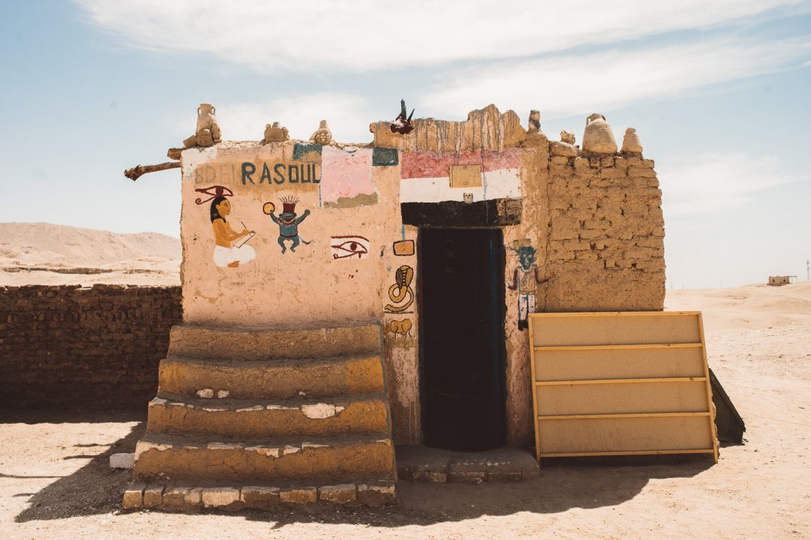

Il est temps d'ouvrir le carnet de ce voyage en Egypte, cette croisière hors du temps au fil du Nil que j'ai vécu avec une bande d'amis blogueurs et _Voyageurs du Monde_. Notre bateau était le dernier bateau à vapeur à naviguer sur le Nil. Je vous l'avais d'ailleurs présenté en détail il y-a quelques temps dans un articlé dédié... ce coin de paradis, c'est le **[Steam Ship Sudan.](http://jeremyjanin.com/partir-en-voyage-en-croisiere-en-egypte)** Il est désormais temps d'aller découvrir les richesses de ce pays qui m'a fait rêver depuis tant d'années.

**VOYAGE EN EGYPTE - JOUR 01 : LOUXOR**

Arrivés la veille au soir, nous découvrons au petit matin le plaisir de déambuler dans les jardins et nager dans la piscine du _Winter Palace_ de Louxor. Comment mieux débuter ce voyage en Egypte ? On est tout de suite plongé dans l’ambiance de cette parenthèse intemporelle. C'est l'occasion de faire plus ample connaissance avec nos partenaires de voyages qu'on ne connait que très peu et de partager les premières tranches de rigolade. On pique une tête pour se rafraîchir, on profite des parfums et des couleurs des jardins, on en prend plein les yeux avec la déco de l’hôtel. Cette première matinée est placée sous le signe du repos.

On range les affaires et partons récupérer les clés de nos cabines à bord de notre bateau pour les prochains jours : le **_Steam Ship Sudan_**. Un accueil chaleureux et haut en couleur en guise de bienvenue avant de découvrir les saveurs orientales mijotées par le chef. C'est en musique et danse traditionnelle qu'on découvre nos quartiers pour les prochains jours à bord de ce trésor flottant. On se familiarise avec l'équipage et on a déjà qu'une hâte : découvrir nos chambres dont on a tant rêvé et larguer les amarres. On foule tous ce parquet mythique, on savoure les mots de bienvenue d'Amir, le chef d'équipe du bateau, on scrute les détails à l'intérieur comme à l'extérieur, émerveillés par tant de beauté et de bienveillance lors de cet accueil.

Avant de débuter cette croisière sur le Nil, nous profitons d'être à Louxor pour découvrir un peu la ville, le temple de Karnak et le temple de Louxor au coucher du soleil. Nos premières statues de pharaons, nos premiers hiéroglyphes, c'est assez fou de ce tenir ici, au pied de ces colonnes, de ces stèles et de ces colosses alors que plusieurs millénaires nous séparent de ceux qui les ont érigé. C’est intimidant et fascinant à la fois.

**LE COMPLEXE DE KARNAK**

Situé sur la rive Est du Nil, le complexe religieux de Karnak s'étend sur plus de 2km et a été construit pendant plus de 2000 ans, c'était le complexe le plus étendu de l'Egypte antique. Autant dire qu'on avait de quoi visiter. Le guide a eu du mal à nous contenir autour de lui tant on était dissipés avec l'envie d'explorer et découvrir ce temple.

On se balade, on déambule avec l'allée centrale comme fil conducteur. Je me perds un peu dans les explications du guide entre mes photos et mes yeux qui ne savent plus où regarder. La chaleur commence à m'écraser et je décide de me tenir légèrement en marge de notre petit groupe pour faire quelques images, finalement, je m'aperçois que je ne suis pas tout seul à le faire. Bravo l'assiduité en ce début de voyage en Egypte. En me baladant, je croiserais le regard d'un des gardiens du temple qui me fait comprendre qu'en échange d'un peu d'argent je pourrais faire un portrait de lui. Je lui fais signe que non et refuse, ayant toujours refusé de payer pour une photo où je ne me sentirais de toute façon pas à l'aise dans cette pratique. Finalement le gardien, revient me poser la main sur l'épaule quelques minutes plus tard et m'embarque au milieu des colonnes. Il bredouille quelques mots d'anglais et moi, pas un seul d'arabe mais malgré tout, il me montre des alignements de hiéroglyphes entre le premier, deuxième et arrière plan dans la construction. C'est assez bluffant, scotchant et fou de voir à quel point les graveurs et architectes de l'époque prévoyaient absolument tout dans les moindres détails qui parfois, dépassent l'entendement. C'est fascinant de voir les alignements entre les illustrations pour donner un certain message à plusieurs dizaines de mètres entre eux. Finalement, la découverte se poursuit et je me retrouve tout seul avec le gardien à l'écart du groupe, un peu malgré moi mais malgré tout scotché par ce qu'il me montre.

Au bout d'une dizaine de minutes, je lui fais comprendre que je vais m'éclipser rejoindre le groupe. Il me fait signe de prendre une photo, je lui dis que je ne préfère pas s'il attend de l'argent, et me dit qu'il ne veut pas d'argent et finirai par repartir avec son portrait et son grand sourire quand il a découvert son visage sur l'écran de mon appareil. :)

**LE TEMPLE DE LOUXOR**

Le temple de Louxor est dédié à 3 divinités Amon, Khonsou et Mout. Il était relié au Temple d'Amon à Karnak par une ligne de 2,5km qui traversait toute la ville. Il est plus modeste que le complexe de Karnak avec ces 260m de long et 50m de haut, mais on le découvre sous les couleurs enflammées du coucher du soleil qui viennent embraser la roche du temple. Les contrastes et les teintes orangés transcendent le lieu, un puit de lumière ici, un rayon de lumière sur des hiéroglyphes par là puis les lumières qui viennent éclairer l'édifice à la nuit tombée. Le temple prend de sa superbe aussi vite que la lumière change.

À la nuit tombée, alors que les pierres sont encore chaudes mais que le noir commence à envelopper la ville, nous nous écartons pour aller déambuler dans les ruelles de la ville, entre épices, art et souk. On se sent téléportés et en train de nager en plein dépaysement.

Au bout de quelques heures, on finit par rejoindre nos cabines pour notre première nuit sur le Nil. Nous resterons à quai jusqu’au lendemain après-midi, pour poursuivre quelques visites le matin dans la région de Louxor… Même s’il nous tarde déjà à tous de commencer la navigation.

**VOYAGE EN EGYPTE - JOUR 02 : DES COLOSSES DE MEMNON AU TEMPLE DE RAMSES III**

5h du matin, Louxor s’éveille. Bercés par les clapots du Nil contre la coque du Steam Ship Sudan, le premier réveil de ce voyage en Egypte se fait sous la douceur des premiers rayons de soleil sur Louxor. Les montgolfières viennent parfaire la vue carte postale depuis la baie vitrée de notre cabine à l'avant du dernier bateau à vapeur à naviguer sur ce fleuve.

**LES COLOSSES DE MEMNON**

On ne descend pas côté ville mais côté Nil pour prendre place à bord d'une barque pour rejoindre l'autre rive. La vitesse du bateau nous apporte juste ce qu'il faut de brise pour rafraîchir ce début de journée qui monte petit à petit en température. Le pied à nouveau sur la terre ferme, on prend alors la route pour aller voir l'un des monuments que j'attends le plus de ce voyage en Egypte : le temple de **Ramsès III**. Avant de découvrir cet édifice, on fait une halte (un peu au milieu de nulle part) pour saluer les **colosses de Memnon** qui se dressent au bord de la route et en plein milieu de champs de culture. Ces 2 statues d'une vingtaine de mètres chacune et taillées dans un seul bloc symbolisent l'entrée de l'Amenophium, le temple funéraire du roi **Amenophis III**. Seul hic, si l'on retrouve encore aujourd'hui des statues, stèles et autres objets enfouis dans le sol du site, les colosses de Memnon sont, eux, les seuls vestiges encore debout. Les pierres du temple ayant sûrement servies à construire d'autres édifices. Ce premier arrêt "vieille" pierre est le début d'une longue série. Les noms des rois, Dieux et autres édifices me replongent d'emblée dans l'imaginaire de l’égyptologue que je rêvais d'être à l'adolescence.

**LE TEMPLE DE RAMSES III**

Nous poursuivons notre route pour l'un des moments forts de cette première journée : la visite du temple de Ramsès III. L'arrivée au milieu des immenses parkings de bus nous rappellent qu'avant la révolution égyptienne de 2011, ce temple était pris d'assaut par des hordes de touristes. Je me souviens alors des photos argentiques que mes grands parents m'avaient montré au retour de leur voyage où l'édifice était noir de monde. Aujourd'hui, il n'en est rien, les touristes ont, malheureusement pour le pays, déserté la destination. Il nous semble comme privatisé tant il y-a peu de monde. C'est assez fou de pouvoir découvrir ces lieux chargés d'histoire aussi librement. On a le sentiment mitigé de savourer cet instant rare et en même temps, touché de savoir à quel point le tourisme dans le pays et ceux qui en vivent, souffrent de cette situation.

C'est fascinant et intimidant de se tenir là, debout, face à cet temple, plus de 3000 ans après la fin de sa construction. Situé à Medinet Habou sur la rive ouest du Nil, le temple dédié au pharaon Ramsès III mesure plus de 150m de long et regorge de petites portes, pièces cachées et de colonnes immenses. On se sent infiniment petit au milieu de ces blocs de pierre gravés de hiéroglyphes de toute part.

Après avoir salué une dernière fois le temple de Ramsès III, nous mettons les voiles vers un nouveau lieu, pilier de l'histoire égyptienne : les trois vallées. La vallée des Reines abrite les tombeaux des reines et de leurs filles, la vallée des Nobles accueille plus de 400 tombes de proches des pharaons et la vallée des Rois, quant à elle, est la nécropole des pharaons du Nouvel Empire.

La vallée des Reines comporte une petite centaine de tombeaux de reines et de leur filles issues des dix neuvième et vingtième dynasties. Seul une poignée de ces tombeaux sont accessibles aux touristes et on n'ose pas imaginer les trésors que certaines d'entre elles, non ouvertes au public, doivent abriter. Si nombres de ces tombeaux ont été pillés, il faut avouer que celles qu'on a eu la chance de visiter étaient époustouflantes de par leur état de conservation. Les couleurs des peintures et le niveau de détail après des millénaires à l'épreuve du temps, des pillages et des éléments, étaient vraiment incroyables.

Les estomacs commencent à s'agiter en ce début de voyage en Egypte, pressés de goûter à la délicieuse cuisine du chef. Nous rentrons au bateau, des souvenirs et des couleurs déjà plein la tête, pour se délecter du déjeuner et se laisser guider au fil du Nil direction Esna. J'ai passé des heures à scruter les rives du plus grand fleuve du monde. Le silence et le paysage incitent à la détente et au calme. Ce sont là les premières heures de navigation de ce voyage hors du temps. On est comme dans une bulle où l'on ne se soucie de rien, se laissant guider par l'embarcation sur les flots du Nil avec une belle bande de copains et un équipage aux petits soins. On s'affaire à bâbord pour scruter le passage du soleil derrière les montagnes environnantes avant de remonter sur le pont principal pour se laisser bercer et savourer ce moment, tous ensemble, insouciants et cheveux au vent.

La suite du récit de ce voyage en Egypte se continuera au fil de la navigation et des découvertes jusqu'à Assouan puis à la découverte du Caire, du Sphinx et ses pyramides très bientôt. Enfin, un gros coup de coeur pour la bande de blogueurs avec laquelle je suis parti : [**Anne**](http://le-chien-a-taches.com/) et Kévin, [**Alice**](http://tippy.fr) et Alexandre, [**Juliette**](http://jenesaispaschoisir.com) et [**Gaetan**](http://instagram.com/gaetan), [**May**](http://www.vie-de-miettes.fr/) et Anthony, [**Laëtitia**](http://eleusis-megara.fr) et [**Samantha**](http://paris-tu-paris.fr).

* * *

Un grand merci à l'agence [**Voyageurs du Monde**](http://www.voyageursdumonde.fr/voyage-sur-mesure) pour ce voyage en Egypte vraiment magique.
