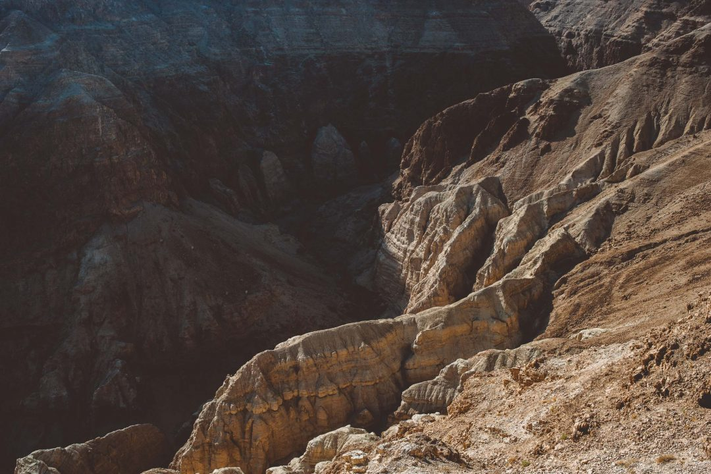

En octobre dernier, je suis parti voyager en Israël pour un long week-end pour fuir la grisaille et retrouver un peu de chaleur. Tel Aviv, Jérusalem, la mer Morte, le désert... Un pays qui me faisait rêver depuis mes premiers cours d'histoire. Je ne suis pas croyant mais l'histoire des religions est quelque chose qui m'a toujours fasciné. Bien que je n'ai pas un savoir incroyable à ce sujet, ça m'a toujours captivé. Lorsque l'office de tourisme m'a contacté pour me proposer d'aller voyager à Israël sur quelques jours, ce fut un grand _oui_. Je me suis documenté en amont pour savoir là où je mettais les pieds et suis parti bien décidé à avoir un aperçu de la destination. Est-ce que voyager en Israël se révèlera être comme dans mon imaginaire ?

#### Avant de voyager en Israël

**En bref**

Israël est à **4h30 de vol** entre Paris et Tel Aviv.

Le déclage horaire est de **+1h** par rapport à la France.

L'argent local est le _shekel : 1 Shekel israëlien = 0,26€ (à l'heure où j'écris ces lignes.)_

8,6 millions d'habitants

Capitale : Jerusalem (mais elle n'est [pas reconnue comme telle à l'international](https://fr.wikipedia.org/wiki/Isra%C3%ABl#Capitale_d.E2.80.99Isra.C3.ABl).)

 **À l'aéroport**

Lors de notre arrivée à l'aéroport, arrivez au moins 3h à l'avance. Je ne respecte jamais ces délais habituellement mais là, c'est on ne peut plus nécessaire. Dès votre arrivée vous serez accueillis puis devrez patienter avant qu'on vous appelle, vous pose de nombreuses questions sur les raisons de votre voyage avant de vider l'ensemble de votre bagage cabine pour vérifier son contenu. C'est une procédure obligatoire et pour tout le monde, mais qui prend forcément du temps.

**Sécurité**

Lors de notre séjour en octobre 2016, nous ne nous sommes jamais sentis en insécurité. On croise des gardes armées ça et là, mais rien de choquant et la gentillesse des locaux est là pour faire taire les a priori qu'on peut avoir.

#### Voyager en Israël : visiter Tel Aviv, entre vieille ville et quartiers branchés.

À peine arrivés à l'aéroport de Tel Aviv, nous filons direction l'hotel _Crowne Plaza_ pour nous écrouler dans notre lit, bercés par les vagues de la Méditerranée. Réveil au petit matin, on se retrouve avec mes compagnons de voyage _Samantha_, _Marine_ et _Gérard_ pour une balade sur la plage devant l'hotel et la promenade le long de la mer. Quelle quiétude de voir le jour se lever, la chaleur méditerranéenne nous envelopper au fur et à mesure que le soleil s'élève dans le ciel. On est surpris et on hallucine d'être ici, avec ces airs de mini Los Angeles, tous ces gens dehors tôt le matin à faire leur sport à la plage, et ces hipsters aux quatre coins de la ville : ce n'était absolument pas cette vision d'une ville moderne que nous avions en venant à Tel Aviv. Quelle belle surprise à laquelle on ne s'attendait pas en venant voyager en Israël et encore plus à Tel Aviv !

Après cette belle balade, on avale un petit dej' et on s'évade pour aller découvrir la ville historique: Old Jaffa. Vieilles pierres et ambiance méditerranéenne garanties, on se sent encore dans un autre endroit du pays. Tel Aviv est calme et hyperactive à la fois selon les endroits. La vieille ville nous apporte un peu de quiétude en surplombant la mer et en déambulants dans ses ruelles pavées pleines de charme. Les appareils photos déclenchent à tout bout de champs pour immortaliser la beauté du quartier. Peu de conseils à donner ici si ce n'est de flâner et prendre le temps de pousser la porte des boutiques et se laisser aller au fil des ruelles qui s'enchainent. Levez la tête pour admirer aussi les terrasses de certaines bâtisses et guettez les ouvertures dans les murs pour apercevoir le bleu azur de la mer par moment.

Nous finissons par quitter Old Jaffa pour rejoindre les quartiers plus modernes de Tel Aviv. En route, on s'arrête dans une ancienne gare réhabilitée avec des bars, lieux d'expos et pas mal de musique. Le coin où les jeunes israëliens branchés se retrouvent. La chaleur est déjà très présente, on en profite pour se rafraichir un peu avant de poursuivre notre découverte de la ville. Cette fois, on déambule à pieds entre les marchés, les rues commerçantes et les zones plus résidentielles. On s'attendait tous à découvrir une ville purement historique et finalement, cette ville assez européanisée nous réserve des tonnes de surprises. On piétine dans les allées bondées du marché couvert, on mangera le meilleur falafel de notre vie pour 2€, on entre et sort des boutiques et des marchands, on s'emerveille des couleurs et des parfums, on se prend Tel Aviv en pleine face pour notre plus grand plaisir. On se sent en sécurité et jamais inquiétés, on déambule à notre rythme sans jamais se soucier. Moi qui appréhendais quelque peu de venir "parce qu'on sait jamais !", je suis tout de suite mis dans le bain et rassuré par l'ambiance et la gentillesse des gens. Les épices, les tissus, les produits cosmétiques bio au sel de mer morte, les falafels, les fruits et légumes... le marché et la ville toute entière tiennent nos sens en éveil. Je ne savais pas à quoi m'attendre en venant ici, la surprise est totale et positive. On s'accorde tous pour dire que c'était la meilleure entrée en matière possible pour appréhender la culture et la vie ici. Il nous tarde déjà de continuer à voyager en Israël et découvrir ce qui nous attend.

#### Voyager en Israël : le desert & la mer morte

Après ce bel aperçu de Tel Aviv, nous n'avons pas arrêté d'entendre que Jérusalem serait bien différente. Avant de nous en rendre compte par nos propres yeux, on fait d'abord un crochet par le désert de Néguev et la mer morte. Je ne vais pas trop m'étaler sur la mer morte car je n'ai pas du tout aimé. L'expérience est à vivre de se laisser flotter mais j'ai été frappé par la quantité de touristes qui pour la plupart n'en ont rien à faire de l'environnement fragile qu'est la mer morte. Les nombreux déchets et les enfilades de gros hotels pour riches russes m'ont répugné. Heureusement, le lever de soleil sur certaines portions un peu plus éloignées des hotels a un peu compensé la déception.

En revanche, j'ai eu un coup de coeur énorme pour le désert de Néguev lorsqu'on a roulé pour rejoindre la mer morte. Même si cette dernière fut décevante, le détour valait quand même la peine car la lumière et le paysage rouge et rocailleux qui nous a accueilli était tout simplement incroyable. On aurait aimé s'y perdre et rester une nuit à la belle étoile tant le lieu était magique et tant nous étions impressionnés face à lui. Les teintes changent au fur et à mesure que le soleil décline et même si la nuit pointe le bout de son nez, nous ne voulons pas partir, nous voulons savourer et en profiter jusqu'au bout de ces couleurs, de ce mélange de sable et de roche. Un paysage digne de mars au milieu duquel on a envie de se perdre et y passer des heures.

Le lendemain on poursuivra la découverte en partant tous les 4 en Jeep avec un chauffeur. Poussière assurée mais expérience validée ! On se fait secouer et on en prend plein le yeux dans le confort spartiate de la jeep multicolore et défoncée. On se faufile au fond d'un canyon, on trace sur une longue piste droite en faisant voler la poussière décollée du sol par les pneus du conducteur en furie. Le 4x4 vibre dans tous les sens et il finit par piler. On se croit au milieu de rien et finalement on s'aperçoit qu'on surplombe un immense canyon avec un panorama à 270°. La vue est à couper le souffle !

On se remet de nos émotions après cette balade en Jeep, direction la forteresse de Masada sous un soleil de plomb. Après avoir continué à longer la mer morte, le point le plus bas sur Terre, on arrive au pied de cette forteresse qui surplombe toute la vallée environnante. On emprunte le télécabine qui nous emmène au sommet et là on découvre un lieu complexe et avec une histoire vraiment riche.

La visite finie, nous prenons la direction de Jérusalem. Le guide nous offre un ultime détour au _Wadi Qelt_, aux portes de la ville. Un lien insoupçonné et au panorama une nouvelle fois : magique. On aperçoit la ville tout au fond en fronçant les sourcils. On savoure ce paysage à perte de vue, cabossé d'un nombre de dunes incalculable. Je crois au fond que c'est surtout le désert que j'étais venu chercher en me décidant à voyager en Israël et je dois bien reconnaître que j'en prends plein les yeux. L'immensité, la quiétude, les couleurs, une vraie sensation de calme et de liberté.

#### Voyager en Israël : à la découverte de la ville historique de Jerusalem

C'était l'une des autres raisons pour lesquelles j'avais envie de voyager en Israël. Un lieu chargé d'histoire, incontournable si on vient dans le pays. Jérusalem, la ville Sainte. Croyants ou non, je pense qu'il y-a vraiment de quoi satisfaire tout le monde. La vieille ville n'est pas immense mais y consacrer 2 jours pour pleinement prendre le temps de découvrir certains monuments me parait être un bon timing. Nous n'avions qu'une journée sur place donc ce fut une visite express mais néanmoins surprenante et qui donne envie de revenir y passer plus de temps. À Jérusalem, on côtoie les 3 principales religions, on passe du quartier juif au quartier musulman en passant par celui des chrétiens. Chaque nouveau quartier bouillonne et laisse place à une nouvelle culture, des nouvelles couleurs, des nouveaux rituels et de nouvelles surprises. On se laisse aller au gré de nos envies, avec le chemin de croix du Christ comme fil rouge de cette visite.

J'ai vraiment apprécié de débuter cette découverte de Jérusalem par une vue sur la ville depuis le Mont des Oliviers. Lieu qui a une importance différente dans chaque religion, je vous laisse faire votre travail de recherche sur internet en fonction de celle dont vous êtes le/la plus proche. Nous sommes arrivés juste à temps pour assister au coucher du soleil et c'était vraiment le meilleur moment. On a vu le soleil s'éclipser derrière la colline qui entoure la ville et baigner les monuments avec une lumière rougeâtre vraiment superbe.

Le lendemain, notre dernier jour complet à Israël, direction la vieille ville. Durant ces quelques heures, on marche beaucoup au gré des ruelles, des monuments plus célèbres, des lieux sacrés et des souks et petites échoppes. On suit le chemin de croix comme fil rouge à notre visite, mais plutôt dans une logique désordonnée pas très logique. On redécouvre les couleurs et les odeurs du marché de Tel Aviv, on s'arrête pour entrer dans une synagogue, une église, on arrive sans s'y attendre face au célèbre _mur des lamentations_. Les hommes à gauche, les femmes à droite. De mon côté, en passant quelques minutes près du mur, j'ai vraiment été scotché par l'ambiance qui y règne. La force du lieu est saisissante. Dans le coin au fond, un jeune adolescent, s'isole et récite ses prières et ses voeux. Là bas, un jeune homme, 25 ans tout au plus, assis sur une chaise, main contre la pierre du mur, s'adonne à la même pratique. J'en compte par dizaine, tous dans un état presque second. C'est puissant à voir, on se fait tout petit et tranquille.

On reprend notre découverte de la ville, on aperçoit le dome du rocher (comment le manquer ?), on va à l'église du Saint Sépulcre, bien que pleine de touristes, l'intérieur est fascinant et vraiment à voir. En temps normal lorsqu'on voyage c'est plutôt Samantha la fan de vieilles pierres, histoire et petites ruelles et moi plutôt la nature mais là il faut avouer que la magie "Jérusalem" a opéré sur nous deux. On avait envie de voyager en Israël depuis pas mal de temps et même si nous aurions aimé y rester plus longtemps, cet aperçu nous a donné envie d'y revenir et s'y attarder davantage. On poursuit la visite au gré de nos envies parmi les ruelles et les marchands. Nous continuons à nous émerveiller face au charme indéniable de cette ville. On en manque pas une miette malgré le peu de temps qu'il nous reste. Cette ville tient toutes ses promesses et me donne déjà envie de revenir en découvrir plus. Moi qui ne suis pas musée et visite guidée, j'avoue avoir qu'une envie c'est y retourner pour une visite ultra poussée pour en découvrir plus sur l'histoire des lieux, les rôles qu'ils ont eu et quelles sont leurs places dans notre Histoire et celle des religions.

#### Voyager en Israël : et pourquoi pas ?

Le voyage touche à sa fin, après ces quelques jours fabuleux au milieu d'une Israël insoupçonnée, il est l'heure pour notre petit groupe de 4 de reprendre un vol (très) matinal, direction l'aéroport de Paris, des souvenirs plein la tête. Je ne suis en général pas un adepte de voyager avec un guide car j'aime faire les choses par moi même, mais pour voyager en Israël, je ne peux que vous encourager que très fortement à prendre un guide avec vous. Il y-a une telle histoire et tant d'anecdotes et faits historiques que ça serait passer à côté d'une grande partie du voyage que de s'en priver tant nous en avons appris durant ces quelques jours.

Pour prolonger le voyage, je vous invite à découvrir les articles de mes compagnons de voyages : [**Marine**](http://lesdessousdemarine.fr/tag/israel/), [**Samantha**](http://paris-tu-paris.fr/category/vagabonde/israel/) et [**Gérard**](https://superchinois801.com/travel/israel/).

 

* * *

_Merci à l'Office de Tourisme ainsi qu'à [Article Onze](http://www.articleonze.com/) pour l'invitation lors de ce voyage._
