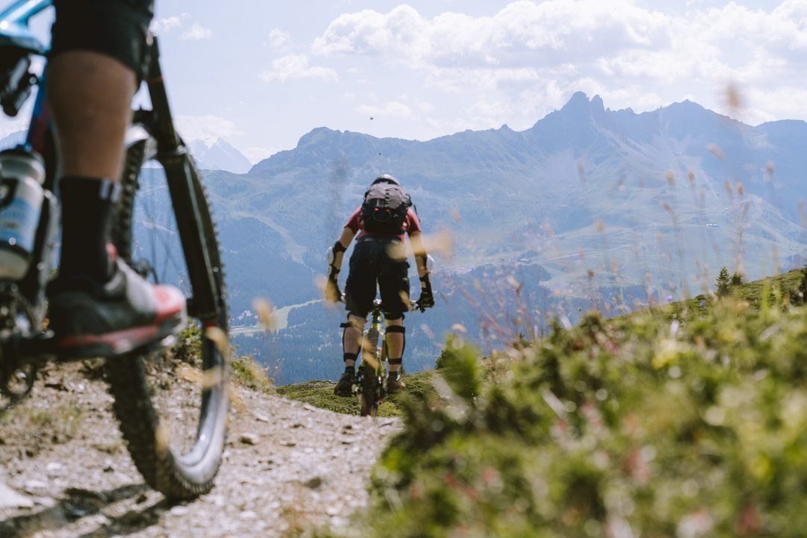
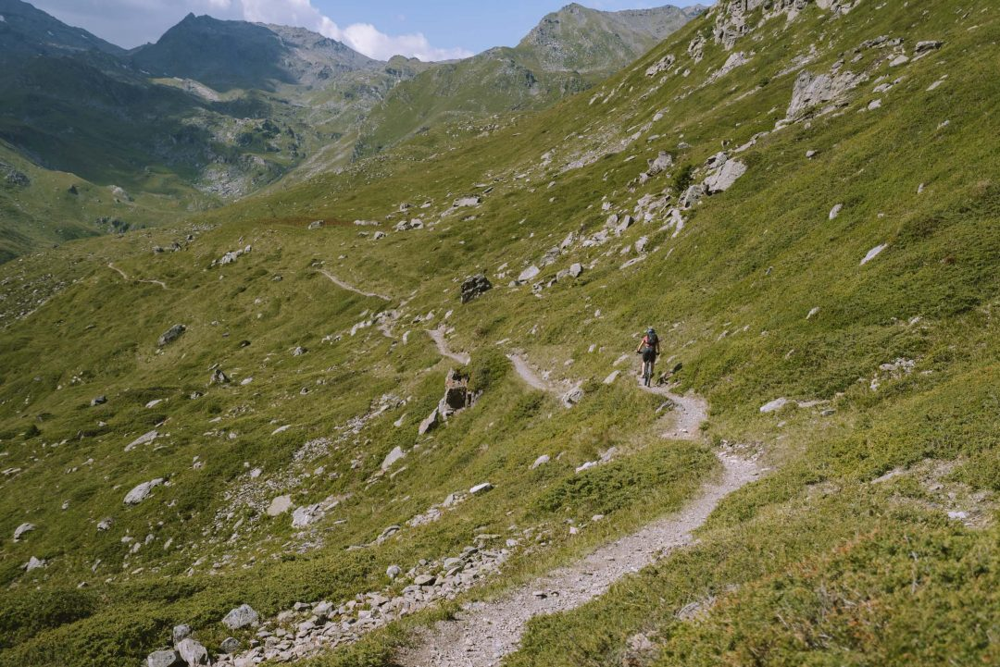
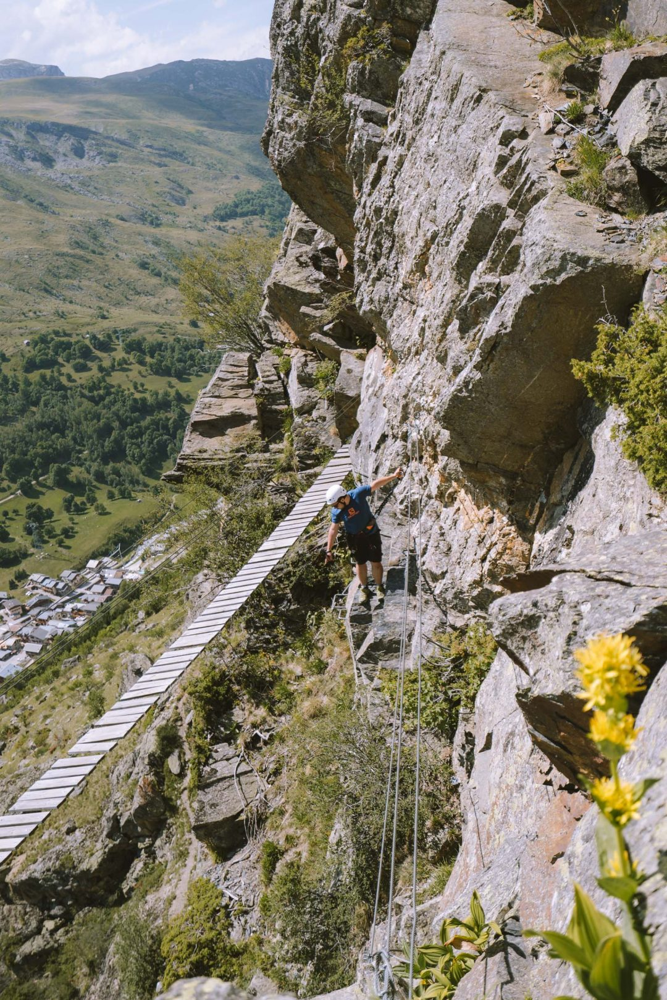

Le week-end dernier, je suis parti pour un week-end VTT aux Ménuires, invité par la station savoyarde pour venir la découvrir en version été. C’est un secret pour personne, je suis un amoureux de la nature et j’essaie de passer un maximum de temps en montagne. Je suis parti avec Alex, mon meilleur pote depuis la fin des années collège, avec qui j’ai connu mes premières sorties VTT il y-a plus de 10 ans. Le rendez-vous était donné à 8h en ce vendredi matin. Alex passe me récupérer, on charge les duffle bags, le matos photo et les protections dans le coffre et on s’échappe de Lyon pour 3 jours au vert. 2h30 de route plus tard, nous voilà au pied de la Croisette, la place centrale de la station, prêt à profiter de ce week-end VTT aux [Ménuires](http://lesmenuires.com/).

<iframe src="https://www.facebook.com/plugins/video.php?height=314&href=https%3A%2F%2Fwww.facebook.com%2Fdjisupertramp%2Fvideos%2F1442551662457047%2F&show_text=false&width=560&t=0" width="560" height="314" style="border:none;overflow:hidden" scrolling="no" frameborder="0" allowfullscreen="true" allow="autoplay; clipboard-write; encrypted-media; picture-in-picture; web-share" allowFullScreen="true"></iframe>

Pour l’anecdote, nous allions déjà rouler aux Ménuires l’été, il y-a plus de 10 ans pour 1 semaine. On chargeait la ZX de sa mère et prenions les petites départementales pour arriver 4h30 plus tard. Beaucoup de choses ont changé depuis, mais on reconnait des lieux et les souvenirs refont surface : « Tu te souviens quand on filmait avec nos appareils photos en 480p et en 4/3 avec la bande violette quand le capteur était exposé face au soleil ? », « Tu te souviens qu’on montait tout ça sur Movie Maker sur fond de hard rock pour faire plus cool comme les vidéos de VTT de l’époque à la _New World Disorder_ avec des titres faits sur Paint ? », « Tu te souviens qu’on coupait les escaliers à vélo pour arriver plus vite au télésiège ? ». Ah les bons souvenirs des ados pseudo freeriders qui sommeillaient en nous ! Il est 12h et nous avons posé nos sacs dans l’appartement où nous passerons l’ensemble du séjour. On avale un déjeuner sur le pouce, préparons les dernières affaires et filons louer les VTT d’enduro pour quelques descentes pour se mettre en jambe avant demain.

**FAIRE DE L’ENDURO / DESCENTE VTT AUX MENUIRES**

En ce vendredi, seules les remontées du secteur du ROC 1 sont ouvertes. On enchaîne quelques descentes « _Girauds_ » (verte), « _P’tit creux_ » (bleue) avec des passages sur les rouges pour se remettre en jambe et prendre le temps de faire quelques images. On sait que demain, ça sera plus intense mais que c’est bon de prendre de la vitesse, enchaîner les bosses et les virages relevés, chercher à optimiser la trajectoire… les sensations sont là, très vite et on s’éclate déjà sur ses premières pistes faciles.

Ce fut court mais vraiment bon. 16h30 sonne la fin des remontées, on part rendre les VTT, éditer quelques images avant de profiter des avantages de la carte multipass en allant se détendre à la piscine et au sauna (dont je suis tombé amoureux depuis mon voyage en [**Finlande**](http://jeremyjanin.com/finlande-voyager-en-laponie-a-lautomne) et y vais dès que possible)! Le bonheur simple mais au combien régénérant après un aprem VTT aux Ménuires.

**LA « DEGAGE À MOUTIERS » EN VTT**

Le lendemain matin, les premiers rayons du soleil nous extirpent du lit, il est l’heure de peaufiner les 2 ou 3 détails avant une longue et belle journée de VTT aux Ménuires. On passe récupérer nos vélos d’enduro avant de retrouver Jérôme, MCF, moniteur et guide VTT dans la station, basé au bureau des guides qui va nous emmener sur cette belle descente. La « Dégage à Moutiers » c’est 20km de descente pour 2000m de dénivelé négatif. La piste est côtée rouge avec quelques passages côtés noir en fin de parcours notamment. On part des crêtes dans le secteur du télésiège du ROC 2 des Ménuires, pour finir beaucoup plus bas dans la vallée au cœur de la station de Brides Les Bains.

On commence par profiter de quelques kilomètres sur les crêtes qui surplombent tout le massif alpin qui nous entoure avec une vue de choix face au Mont Blanc. Les petits singletracks _(chemins mono traces)_ sont rapides et techniques, un peu cassants par endroit, plus roulant à d’autres. Le paysage défile au rythme de notre avancée à trois sur ces crêtes et on en prend plein les yeux. On enchaîne les appuis naturels, les passages rocailleux, les virages plus serrés calés dans la roue de celui qui nous précède. Une sensation de liberté et de bonheur intense que de rouler ici... sans croiser personne. On ne se lasse pas de cette vue qui nous accompagne, on se retourne pour voir ce qu’on vient de descendre; déjà sur un petit nuage alors que ça ne fait que commencer. Jérôme, notre guide, est vraiment hyper accueillant et cool avec nous. On prend du plaisir à rouler et ça se voit, même si clairement, il aurait largement pu nous déposer, disons-le !

Une fois les crêtes terminées, on plonge dans la forêt sur des single un peu plus cassants et humides dûes aux récentes chutes de pluie ce qui rend le pilotage sur les cailloux fuyants et les racines détrempées un peu plus technique encore.

La Dégage à Moutiers commence réellement au moment où on plonge dans cette forêt et c’est une toute autre ambiance que les crêtes que l’on vient de traverser. Plus sombre, plus technique avec une ambiance un peu canadienne avec toute cette mousse sur les arbres, rochers et racines, les fougères et les sapins. Il y-a quelques passages de pierriers, délicats à franchir avec la boue et souvent on manquera de classe et de grâce pour les passer. C’est du pur régal, le relief passe d’appui en appui pour prendre de la vitesse, on lâche les freins avant les racines pour passer plus vite, on maintient fermement le guidon et tâche de placer le vélo où on a envie pour éviter d’aller voir la terre de plus près ! On continue à dévaler cette piste sous les arbres et sur les feuilles mortes qui couvrent un terrain toujours plus humide et délicat à appréhender surtout sur les portions de freinage. Il paraîtrait, peut-être que j’ai pu, à un moment glisser et perdre l’équilibre pour me retrouver dans la boue. Mais ce ne sont que des rumeurs sans preuve, évidemment. On enchaine encore quelques kilomètres dans des portions tantôt rocailleuses et très techniques tantôt plus roulantes en sous bois où on peut lâcher les freins et parfois avec quelques sections de pédalage de quelques secondes. Peu de temps avant l’arrivée à Brides, on hésite à une intersection entre passer par la fin sur la piste rouge avec deux coups de cul à grimper ou la noire, plus descendante et plus techniques mais que Jérôme n’avait pas repéré depuis quelques temps. On réfléchit peu et on se lance dans la noire avec des single super roulants, parfois aériens avec des trajectoires qui frôlent le ravin à quelques centimètres de mes pédales, énorméments d’appuis en forêt contre les talus et des petits sauts naturels. On arrive finalement à Brides quelques heures plus tard pour récupérer la navette pour remonter aux Ménuires. Le temps de grignoter un sandwich et refaire le plein d’énergie, nous récupérons la navette direction Méribel. Ce week-end VTT aux Ménuires tient toutes ses promesses et on en a pris plein les yeux !

La piste dans son ensemble est relativement technique et ne convient pas à un débutant qui n’a jamais fait de VTT, je vous recommande plutôt de découvrir les joies du VTT en restant sur les pistes de la station dans ce cas, pourquoi pas avec les conseils d’un guide. Je n’ai jamais été fan de prendre un guide, j’aime découvrir les choses par moi-même et j’ai toujours eu cette image un peu erronée du guide au fond. Jérôme aura vraiment bousculé mes préjugés, car ce fut super agréable de rouler et partager ce moment avec lui, en découvrir un peu plus sur la piste et les montagnes qui nous entourent sans pour autant être excessif dans les explications. Si vous allez aux Ménuires, n’hésitez pas à demander Jérôme !

**ALLER AU LAC DU LOU EN VTT ELECTRIQUE**

Pour ce dernier jour de week-end VTT aux Ménuires, on a décidé de louer des VTT à assistance électrique. Il s’agissait de VTT de rando (cross country) classiques mais équipés d’un moteur et d’une batterie pour assister au pédalage. L’énorme avantage, c’est que ce type de vélo ouvre de nouveaux horizons pour se balader. C’est la solution parfaite pour partir découvrir un endroit où il n’y-a pas de remontée mécanique par exemple ou pour faciliter le pédalage. On a donc quitté la Croisette des Ménuires pour pédaler jusqu’au **Lac du Lou (2085m)**, le lac le plus populaire et assurément l’un des plus beaux de la station. Après 45minutes de montée (nous ne sommes pas passés par la piste la plus courte, il y-a beaucoup plus rapide) d’abord sur la piste 4x4 puis en passant par un singletrack d’une piste enduro nous arrivons au dessus du lac en cours de matinée. Le lac est relativement grand, bordé de pâturages et avec une vue assez dingue sur les sommets voisins. C’est une endroit accessible en famille à pied, mais ce fut que du bonheur d’y aller en VTT et là descente fut… rapide pour rentrer au centre de la station.

**FAIRE DE LA VIA FERRATA AUX MENUIRES**

Après le déjeuner, on décide de louer un peu de matos de via ferrata pour une dernière activité dans ce week-end bien rempli, avant de reprendre la route pour Lyon. Baudrier, casque, double longe et absorbeur de choc : OK. On optera pour la via ferrata côtée « peu difficile » de Levassaix aux portes des Ménuires. 350m de distance, comptez 1h30 en moyenne et prévoir une quinzaine de minutes de marche d’approche avant de se retrouver au pied de la paroi. On s’accroche à la longe métallique, on traverse un premier pont de singe avant de commencer à grimper à flanc de falaise. Les sensations sont là, on s’accroche, on se déplace et on compose avec le relief : que du bonheur.

Une fois arrivé au sommet de la via, il est déjà l'heure de retourner à la voiture, pour rendre le matériel dans la station et de clore le chapitre de ce week-end VTT aux Ménuires. Ce week-end fut haut en couleurs et en sensation, du pur régal, la montagne l'été est définitivement pleine de surprises mais avec très peu de monde sur place, ce qui en fait un endroit idéal à cette saison si vous voulez profiter d'un lieu sans des hordes de touristes. Si vous faites déjà du VTT : foncez les yeux fermés, rien que pour vivre la Dégage à Moutiers et enchainer quelques descentes sur la station, mais il y-a énormément d'autres chemins à découvrir. Si vous n'avez jamais fait de VTT, il y-a des pistes pour tous les niveaux et les guides sont là aussi pour vous apprendre et vous guider en sécurité pour découvrir la discipline. Pour ma part, ce fut du bonheur en barre du début à la fin. Un bon week-end VTT aux Ménuires pour déconnecter et profiter de la nature tout simplement.

#### **INFOS PRATIQUES WEEK-END VTT AUX MENUIRES**

La station de **Les Ménuires** est située à 2h30 de route depuis Lyon.

Carte **[Multi Loisirs](http://lesmenuires.com/ete/activites/carte-multiloisirs/),** incluant remontées mécaniques, accès au sauna, piscine et de nombreuses autres activités  **à partir de 21€.**

**Location VTT (tarifs) :**

- Enduro / Descente : 80€ / jour _avec protections incluses._
- VTT à Assistance Electrique : 40€ / ½ journée. _Casque inclus._

**Location matériel via ferrata (tarifs) :**

Baudrier, casque, double longe et absorbeur de choc : 12€ par personne.

Office de Tourisme : [lesmenuires.com](http://lesmenuires.com/)

Vous avez déjà essayé le VTT de descente ? Vous connaissiez les Ménuires en été comme ça ? Cet article vous a donné envie d'essayer ? Racontez moi en commentaires :)

_Un grand merci à Estelle et l’Office de Tourisme des Ménuires pour leur invitation et leur accueil chaleureux lors de ce week-end. Je suis invité mais reste toutefois totalement libre de mon récit et décris mon ressenti exact suite à cette expérience._

Photos et vidéos prises avec un [**Sony a7sII**](http://amzn.to/2pbwsRF), une GoPro [**HERO5 Black**](http://amzn.to/2fJUy1P) et une [**HERO5 Session**](http://amzn.to/2w3TXzy) et un drone [**DJI Mavic Pro**](http://amzn.to/2o7zV2G). Si vous voulez en savoir plus, RDV sur ma page [**équipement**](http://jeremyjanin.com/equipement).
