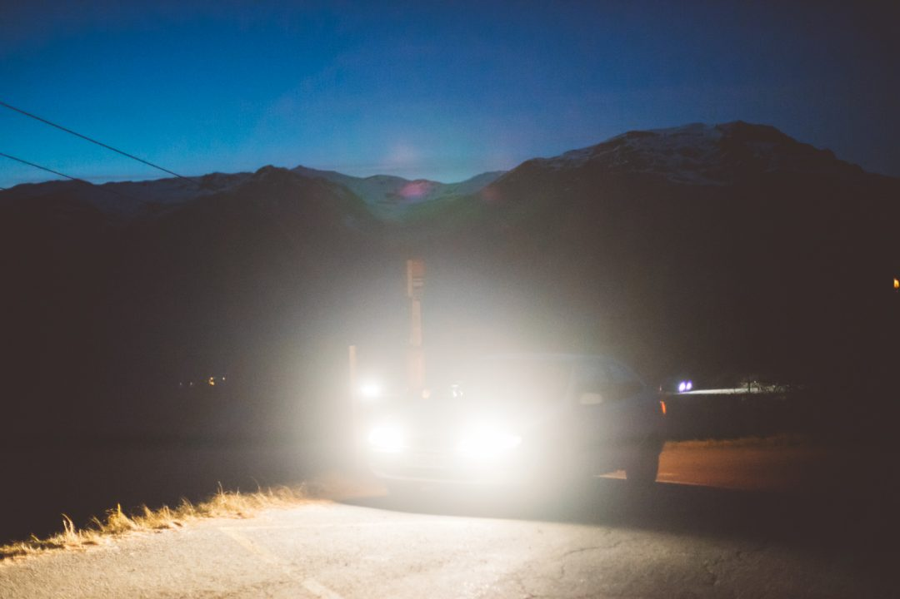

Ça vous dirait un week-end sensation et évasion où on fait le plein d'adrénaline et de grand air ? Fin décembre, je me suis retrouvé pas si loin de chez moi mais quand même assez pour respirer à plein poumon, faire tout un lot de "premières fois" pour moi et vivre un **week-end sensation** riche en émotions aux portes du Parc de la Vanoise.

Il y-a quelques semaines **[Wonder Weekend](https://www.wonderweekend.com/)** m’a demandé si ça me tentait de partir pour un week-end sensation à **_La Plagne_** pour tourner une vidéo ? J’ai dit _« Oui merci beaucoup, c'est par où ?»_ on a fait nos sacs, pris la voiture et 2h de route plus tard depuis Lyon, nous arrivions à bon port, prêts à savourer une première nuit de sommeil avant un week-end riche en activités à partager avec _[**Samantha**](http://paris-tu-paris.fr)_.

**_Week-end organisé en collaboration avec Wonderweekend._**

#### **Week-end sensation à La Plagne.**

_(à 2h de Lyon et accessible en bus ou avion depuis Paris.)_

#### **JOUR 1 | Super tyrolienne, glacier de la Plagne et bobsleigh sur la piste Olympique.**

Réveil au petit matin, le jour se lève sur l'hotel **La Tourmaline**, on finit de se réveiller au son du crépitement du feu qui berce la salle de petit déjeuner, on fait chauffer une crêpe sur la grille de la cheminée, on prend des forces avec un petit dej' de champion avant de gratter le givre de la voiture prendre la route pour faire quelques images et commencer ce week-end sensation : _La Plagne here we come_ !

 

Après quelques virages face au lever de soleil sur le massif du Mont Blanc, on arrive à la station pour la première activité de la journée : la [**tyrolienne**](https://www.facebook.com/supertyrolaplagne/).

Au menu ce matin : **600m de traversée environ 85km/h de vitesse max** pour une grosse trentaine de secondes de "vol" au dessus de la vallée, à travers les sapins.

On prend le télécabine pour grimper un peu et arriver à la plateforme pour s'élancer. Quelques consignes de pré-départ, le baudrier bouclé, on se tient sur ce petit tabouret, je lâche un petit _"j'y vais mais j'ai peur"_ et m'assois dans le baudrier pour me laisser partir dans le vide. C'est parti pour 30 secondes d'émotion. Dès les premiers instants, on se rend compte à quel point la tyrolienne est stable et "controlée", le vent frais frissonne au creux de l'oreille, les yeux s'écarquillent avec le froid, le soleil et le vent et je prends le temps de réaliser que je suis suspendu au dessus du vide, mais à aucun moment on ne se sent en insécurité. Quelques "_youhou_" plus tard, je pose les pieds de l'autre côté de la station après un vol à un fil au dessus du vide. Juste énorme !

À peine dés-arnaché, c'est au tour de Samantha de s'élancer, je la vois arriver comme une fusée depuis _Aime 2000_ pour me foncer dessus à _Plagne Centre._ Le frein la fait s'élever dans les airs puis redescendre sur la plateforme, un sourire sur nos deux visages qui en dit long sur ce début de week-end sensation. Le temps de discuter un peu avec Cyril qui nous encadrait sur la descente et il est l'heure de partir pour le **glacier de La Plagne**.

 

 

Une grosse demi-heure de téléphérique nous attend pour nous remettre de nos premières émotions. On récupère nos pass piéton aux caisses à forfait au pied des pistes et on prend déjà de la hauteur. On profite de la vue aérienne qui s'offre à nous pour observer les sommets, les skieurs. Plus on monte, plus le paysage s'éclaircit et laisse place à la beauté de la nature qui nous entoure. La dernière partie de la montée a un (gros) ressaut avec un grand plongeon dans le vide avec la cabine avant de remonter jusqu'au glacier.

En arrivant en haut à 3000m d'altitude, on fait un peu tâches à pied au milieu des skieurs venus avant tout profiter de la neige d'altitude. On crapahute, on s'enfonce dans la neige, on se remplit les chaussures. Le soleil tape, il est midi, le ciel est immaculé : une météo parfaite pour profiter et bronzer, mais plus compliquée à gérer pour la photo. On se pose un peu là haut pour savourer la vue et faire quelques images, on regarde un parapentiste décoller : demain c'est mon tour !

On se remet doucement en route pour retourner à la station, on est attendus un peu plus bas pour notre coup de coeur de ce week-end sensation : le **bobsleigh**. (Même si en vrai, j'ai tout adoré !)

 

 

La journée a filé à toute allure, l'heure de la dernière activité du jour a sonné et on finit en beauté sur la piste olympique de bobsleigh des JO d'Albertville, piste d'entrainement de l'équipe de France de bob. On est vraiment curieux à l'idée de découvrir les sensations du bobraft.

Le **bobraft** est l'activité la plus accessible sur la piste puisqu'on peut être 4 personnes maximum dedans, pas besoin de pilote, le bob est articulé et suit le mouvement de la piste.

La **luge** permet de s'élancer seul sur la piste, on a pas testé, mais j'adorerais y retourner pour essayer ça doit être fou (et flippant) d'être seul et tout voir défiler à cette allure.

Le **bobsleigh olympique** là on entre dans une autre catégorie, puisque ça se passe dans un bob de compétition tel qu'on les voit à la TV, avec un pilote de la structure qui se charge du pilotage. Le bob monte à plus de 120km/h dans la descente et boucle la piste en moins d'1 minute. Je l'ai ajouté dans ma _bucket-list_ après avoir vécu le bobraft !

Revenons à notre bobraft. Le début est calme et lent et on se dit _"oh ça va c'est à la cool"_ et puis le premier virage arrive et là, on passe dans un nouveau monde où tout défile à une vitesse vraiment incroyable... et pourtant ce n'est "que" **80km/h**. Je n'ose même pas imaginer si on faisait du bob olympique.

La sensation est folle. On a le smile du départ à l'arrivée, on enchaine les courbes, le bobraft remonte dans les virages sans jamais perdre de vitesse, on dévale la piste de glace comme une fusée inarrêtable. Ce n'est ni trop court ni trop long, on se fait secouer, ça défile, ça crisse sur la glace, ça cogne, c'est juste trop bon ! Quand on arrive en bas, on ressort du bob, on se regarde en lâchant un gros _"wow"_ avec qu'une envie : recommencer. Quelle expérience ! C'est vraiment à faire une fois dans sa vie et venir ici sans faire du bob, ça serait comme aller à Sydney sans voir l'Opéra, c'est un _must_ que je vous recommande vraiment !

 

 

On rejoint la voiture sous un coucher de soleil magique avant de redescendre les virages de la station jusqu'à La Tourmaline pour trouver un peu de repos mérité pour se remettre de nos émotions de ce premier jour. Aucun doute on est bien en plein week-end sensation ! En route, on s'arrête photographier la piste de bobsleigh qu'on vient de descendre de plus loin, il fait nuit, elle est éclairée et ça donne un joli zig zag de lumière à flan de montagne.

Après l'avoir repéré le soir de notre arrivée, je me précipite au sauna de l'hotel, je n'y suis pas retourné depuis mon séjour en Finlande, et c'était vraiment bon de renouer avec ça. Je suis définitivement fan des saunas, et comme en Laponie, j'ai très vite discuté avec un couple de passage ici pour le week-end. Le sauna ça rapproche. Après avoir évacué les toxines, direction le jacuzzi pour barboter. Je ressors de là, revigoré et me sens sain. Il est temps d'aller dévorer une tartiflette :D.

On descend à la salle à manger de l'hotel et retrouvons avec plaisir le feu de cheminée qui donne une ambiance ultra cosy à cette soirée dans cette pièce entre pierres et bois. Rien de mieux qu'un bon plat local et bien chaud pour se remémorer les bons moments de cette journée avant de nous laisser aller dans les bras de morphée.

 

#### **JOUR 2 | Voltige en parapente**

Nouveau réveil au petit matin, nouveau petit dej' de champion entre crêpes, pain frais et viennoiseries. Un choix qui a failli me couter cher, n'ayant pas pensé que la voltige allait peut être donner du fil à retordre à mon estomac. On savoure un nouveau lever de soleil sur les monts voisins en montant à la station. On en profite pour faire quelques images. On grimpe au sommet des **Grandes Rochettes** et retrouvons **Denis Verchère**, pilote pro de parapente, wingsuiter, base jumper et pilote de voiles en tout genre au palmarès impressionnant. C'est passionnant de l'écouter raconter son  histoire, comment il a été l'un des précurseurs du parapente freestyle en France il y-a quelques dizaines d'années et d'en apprendre plus sur le parapente en général.

Ce matin, je suis comme un gosse, je m'apprête à réaliser un rêve qui me trotte dans la tête depuis des années. Je n'ai aucune appréhension et pleinement confiance en Denis. Le vent n'est pas au rendez-vous mais par chance, il finit par tourner et à nous donner des ailes pour décoller. C'est le moment de s'élancer, je laisse Samantha sur le pas de décollage et tracte Denis pour qu'on s'élance dans le vide. Je cours, cours, cours, on décolle, ça repose sur une petite bosse, je continue à courir, ça y-est on est en l'air. _Wouhouuuu_. C'que c'est bon. Moi qui vois toujours les montagnes grâce à mon drone, aujourd'hui, j'ai la chance de voir ça de mes propres yeux. C'est juste énorme ! La stabilité des premières minutes est déconcertante, c'est hyper agréable, on a le temps de profiter du vol et du panorama.

Et puis à peine le temps de dire ouf, que Denis s'emballe pour une descente en voltige vertigineuse à 20m/seconde. Il tire les sous-pentes à gauche, à droite, on tourne, on virevolte, j'ai la tête en haut, en bas, les pieds à l'envers et parfois à l'endroit, je me retrouve la face en direction du sol et repars dans l'autre sens avant d'avoir réalisé que j'étais à l'envers, pieds vers le ciel, tête vers le sol lancé à toute allure. Mon estomac ne sait plus où donner de la tête, ça secoue, mais les émotions sont dingues.

À quelques mètres du sol, on se stabilise, tout redevient normal, je relève les pieds et on vient se poser en bas d'une piste de ski. Je suis vivant, en bas, les pieds sur terre, la tête toujours en l'air. Ce que je viens de vivre était unique et au delà de ce que j'avais imaginé avec le parapente. J'aide Denis à démêler la voile avant que nos chemins ne se séparent. Je titube un peu, le cerveau et l'estomac toujours quelques mètres au dessus de ma tête en train de virvolter mais le sourire grand comme ça, entrain de savourer et essayer de comprendre ce qu'il vient de se passer.

Je grimpe dans la navette gratuite pour remonter à la station où je retrouve Samantha, plus heureux que jamais. Il est l'heure pour nous de reprendre la route, ce week-end sensation touche à sa fin, mais qu'il fut bon !

**INFOS PRATIQUE**

**_Comment aller à La Plagne ?_**

2h de route de Lyon, aussi accessible en train jusqu'à Aime puis des navettes en bus jusqu'à La Plagne.

Paris et autres grandes villes, le plus simple est l'avion jusqu'à Lyon, Genève, Grenoble ou Chambéry. Il y-a aussi un bus depuis Paris Bercy.

**Où dormir ?**

Hôtel **La Tourmaline\*\*\*** à Aime (30min de route de la station de la Plagne desservie par une navette depuis le village d'Aime) www.hotel-tourmaline.com

**Quelles activités faire ?**

**Super Tyro**

**[Super Tyro](https://www.facebook.com/supertyrolaplagne/)** est une entreprise familiale toute neuve qui permet de relier deux bouts de la station en faisant le plein de sensation. 18€ / personne.

**Bobsleigh**

**Bobraft** (ce que j'ai fait) vitesse : 80km/h pour 1min35 de descente env.) - 45€ / pers., **Luge** ou **Bobsleigh olympique** avec un pilote pro (120km/h pour 57min de descente env. [www.bobsleigh.la-plagne.com](http://bobsleigh.la-plagne.com/fr/reservez-votre-descente.html)

**Parapente**

**Parapente** avec Denis d'Air La Plagne, adorable et hyper intéressant à écouter parler de son expérience en wingsuit, parapente voltige, longue distance... [www.parapente-la-plagne.com](https://www.parapente-la-plagne.com/)

_Il y-a aussi pas mal d'autres activités à faire pour compléter un week-end sensation (motoneige, grotte de glace, ski...), jetez un oeil sur le site de [**Wonder Weekend**](https://www.wonderweekend.com/sejour-ski/) pour plus d'inspiration._

Impossible de ne pas rentrer heureux et dépaysé après ce week-end, pile ce qu'il fallait avant d'attaquer les fêtes de fin d'année. Entre baptême de tyrolienne, de bobraft et de parapente, ma quête constante d'émotions a été récompensée, un week-end sensation de folie, à vivre, à faire, à savourer et surtout à recommencer !

**_À très vite pour de nouvelles aventures !_**

Suivez mes prochaines aventures en live sur [**Instagram**](http://instagram.com/djisupertramp) / [**Facebook**](http://facebook.com/djisupertramp) / [**Twitter**](http://facebook.com/djisupertramp)
