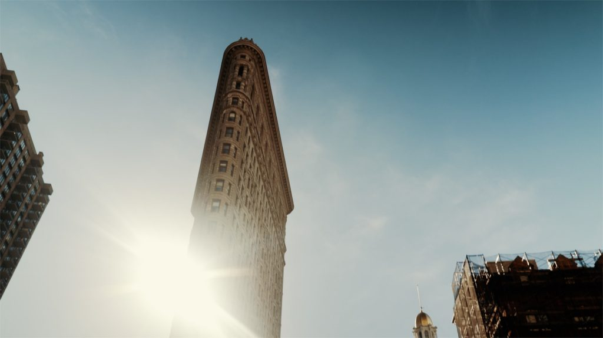
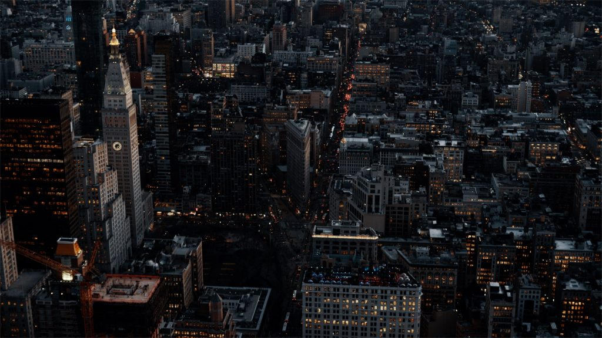
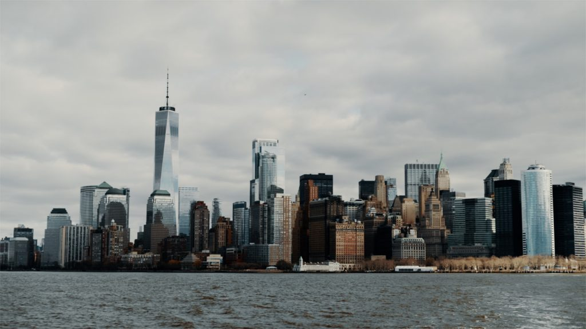
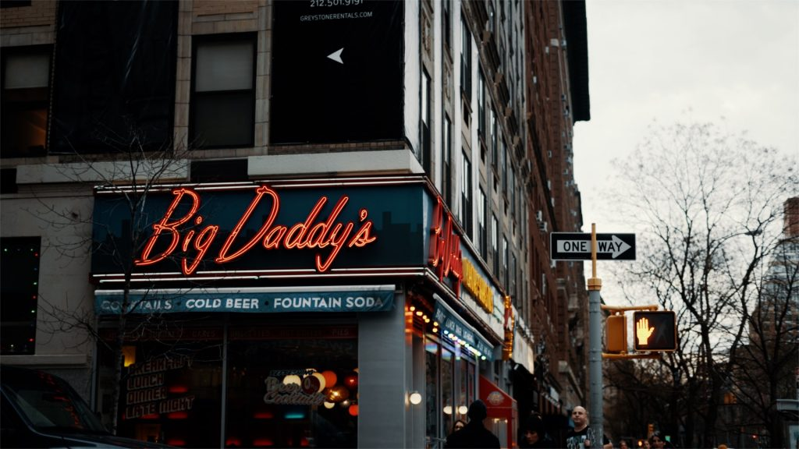
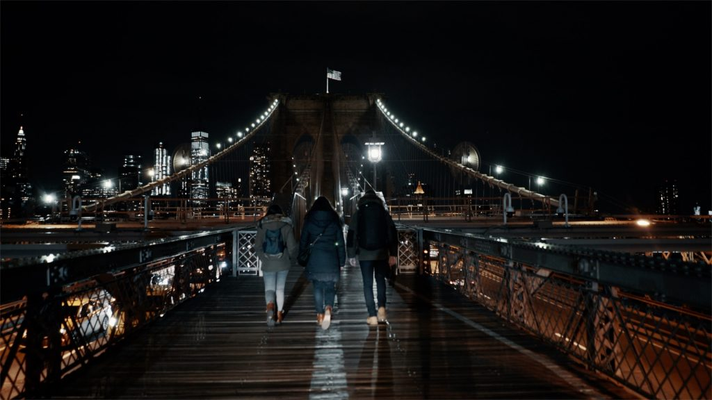
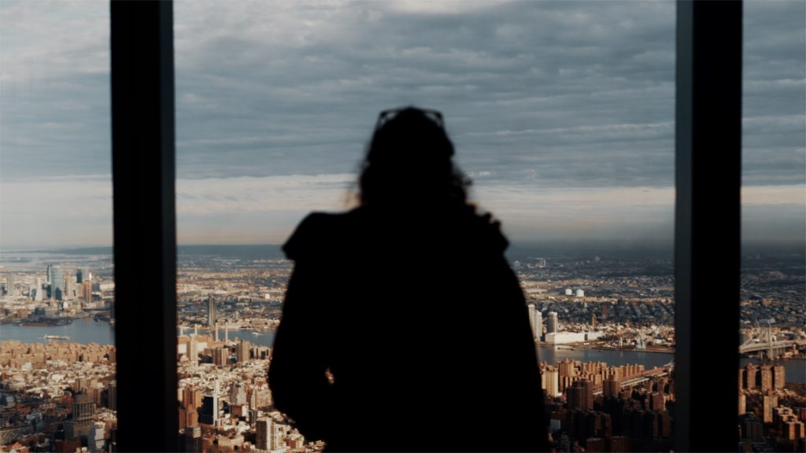
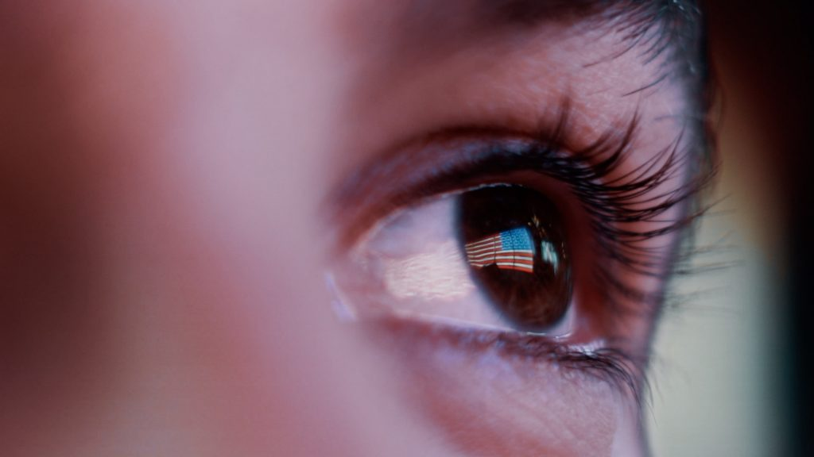
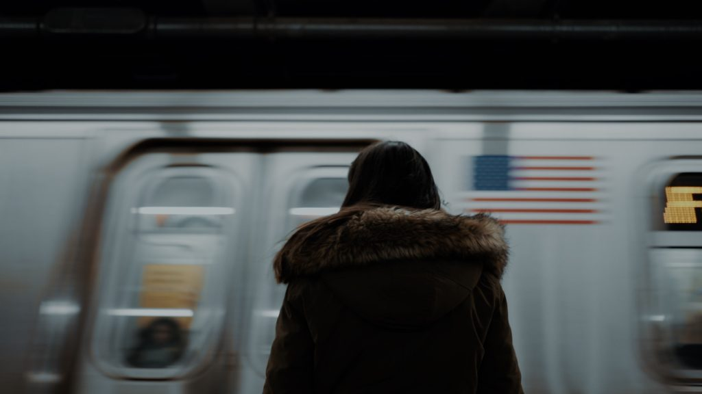
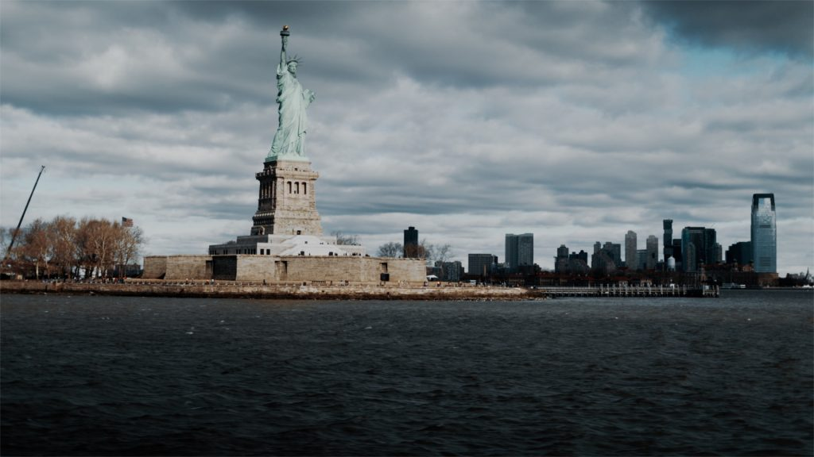
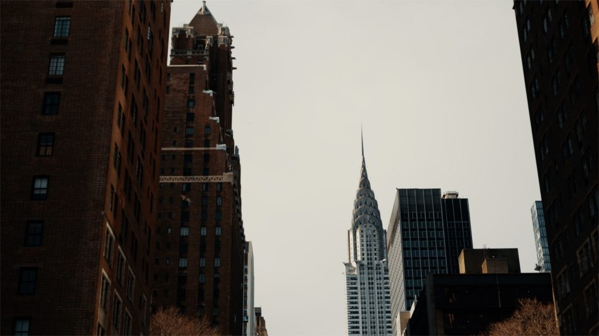

"When In New York", ma vidéo de New York en hiver. Il y-a très exactement 1 an, jour pour jour, on s'envolait pour notre troisième fois à New York. Il y-a ce je ne sais quoi qui nous attire comme un aimant dans cette ville et une envie constante d'y revenir à peine repartis. Il y-a des milliers d'images de New York sur les réseaux sociaux, pas facile de sortir du lot et de se stimuler créativement pour essayer de proposer des plans un peu différents. Je ne sais pas si c'est mission réussie, à vous de me dire, mais en tous cas, je me suis vraiment éclaté à essayer de trouver ces plans et ces idées d'enchainements lors de ce voyage.

https://youtu.be/hlDHqRtWWd4

Ce fut 10 jours intenses, comme à chaque fois à New York. 10 jours à revoir des incontournables touristiques de la ville mais aussi et surtout à prendre le temps d'approfondir davantage, trouver des bonnes adresses (on a trouvé sûrement les meilleurs cookies de New York !), on a enfin pris le temps de visiter le Musée du 9/11 (une visite poignante, comptez près de 3h, mais ô combien passionnante) et d'autres coins qu'on voulait voir ou revoir.Nous étions accompagnés de Nicolas et Alicia, de la famille de Samantha, avec qui on partage énormément de choses. _(Bonus : Nicolas a même demandé Alicia en mariage là bas.)_ On adore partir fin janvier, les billets d'avion pour New York ne sont pas très chers, les rues sont plutôt calmes, il y-a peu d'attente dans les coins les plus connus et on adore cette ambiance hivernale. C'est aussi devenue une sorte de rituelle que d'aller y célébrer l'anniversaire de [**Samantha**](http://paris-tu-paris.fr) dès qu'on peut se planifier une nouvelle virée New Yorkaise. C'était ma troisième visite, mais c'était surtout bien loin d'être la dernière.

**Matériel utilisé :**

**[Sony a7sII](http://amzn.to/2pbwsRF)** **[28mm f/2](http://amzn.to/2AHW65J)** **[55mm f/1.8](https://amzn.to/2r6Kypc)** **[70-200mm f/4](http://amzn.to/2kZ7zKM) [Zhiyun Crane v2](https://amzn.to/2CssX0F)**

